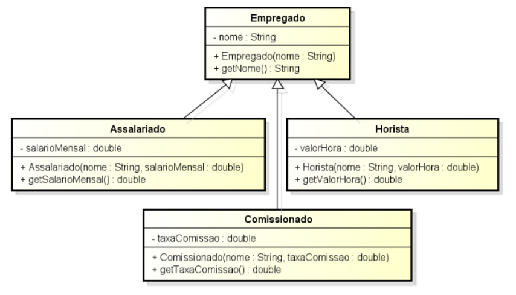

<!SLIDE supplemental ado2>
# ADO 2
## Hierarquia de Empregados

Implementar as classes em Java, de acordo com o Diagrama de Classes e com as informações abaixo. 

Considere as seguintes informações para as implementações destas classes:

* As classes não possuem os métodos seletores no diagrama de classes e não devem ser implementadas.
* Os nomes das classes e métodos devem ser respeitados.

Adicionar o comportamento de calcular salario mensal diferente em cada classe, conforme informações a seguir:

O método deve possuir a seguinte assinatura:

    @@@ Java
	double calcularSalarioMensal();

As implementações devem seguir as seguintes instruções:

**Classe Horista**

O salário mensal é calculado multiplicando-se o valor da hora por 160 horas.
 
**Classe Assalariado**
 
O salário mensal é o próprio salário mensal.

**Classe Comissionado**

O salário mensal é um valor fixo de comissão de 500,00.

Adicionar também a nova Classe FixoComissionado que deve ser filha da classe Comissionado. 

**Classe Comissionado**

O salário mensal é calculado pela soma de seu salário base e do salário mensal relativo a classe mãe de comissionado. 

Atenção: Este método deve utilizar o método calcularSalarioMensal() da classe mãe (usar super.calcularSalarioMensal()).

Adicionar comportamentos diferentes do método que calcula salário mensal em algumas classes, conforme informações:

**Classe Horista**

Um novo método calularSalarioMensal deve ser criado com um parâmetro de entrada que é a quantidade de horas trabalhadas e cujo resultado deve ser a multiplicação do número de horas pelo salário hora.
O método deve possuir a seguinte assinatura:  
double calcularSalarioMensal (int horasTrabalhadas);

**Classe Assalariado**

Um novo método calularSalarioMensal deve ser criado com um parâmetro de entrada que é a quantidade de horas extras trabalhadas e cujo resultado deve considerar o número de horas extras trabalhadas. Para calcular o valor da hora-extra basta dividir o salário mensal por 160 horas e adicionar 50%.
O método deve possuir a seguinte assinatura:  	
double calcularSalarioMensal (int horasExtrasTrabalhadas);

**Classe Comissionado**

Um novo método calularSalarioMensal deve ser criado com um parâmetro de entrada que é o valor das vendas no mês e cujo resultado deve considerar o salário fixo e a taxa de comissão sobre as vendas.
O método deve possuir a seguinte assinatura:  	
double calcularSalarioMensal (double valorVendasMes);

**Classe FixoComissionado**

Não possui nenhum comportamento adicional.

Criar uma classe chamada ProgramaPrincipalEmpregado que contém apenas o método main. Este método deve instanciar cada uma das classes concretas criadas e então imprimir o nome e salarioMensal de cada um.

As seguintes condições devem ser atendidas:
A classe Empregado deve ser impedida de ser instanciada.
O método getNome() deve ser impedido de ser sobreescrito.
As classes Horista e Assalariado devem ser impedidas de serem herdadas.
Fazer com que o método calcularSalarioMensal() seja obrigada a ser implementado por todas as classes filhas da classe Empregado.

**Observações Importantes:**

* A atividade é individual.
* A nota levará em conta os conceitos do paradigma orientado a objetos aplicado corretamente.
* Caso os nomes de classes e métodos, incluindo maiúsculas e minúsculas, não sejam iguais ao do exercício, haverá desconto na nota.
