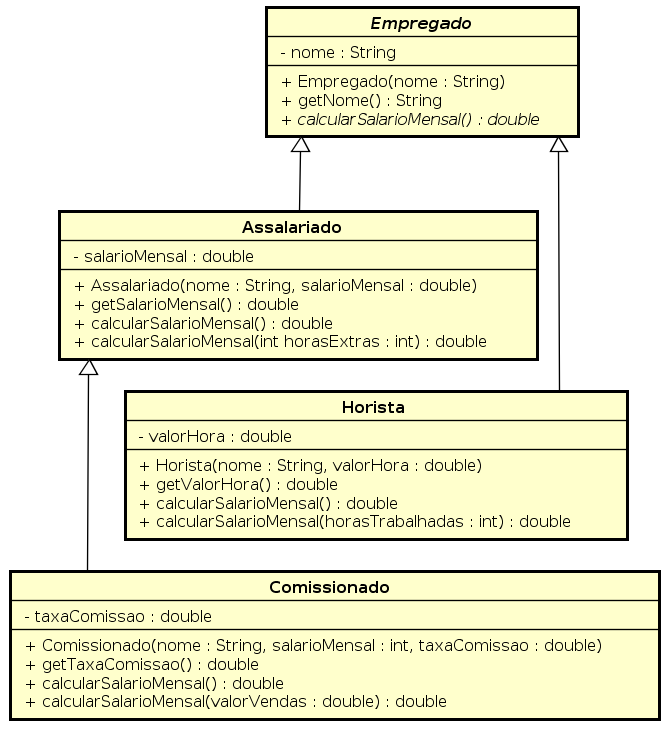

<!SLIDE supplemental ado2>
# ADO 2
## Hierarquia de Empregados

Implementar as classes em Java de acordo com o Diagrama de Classes e com as informações abaixo. 

Considere as seguintes informações para as implementações destas classes:

* As classes não possuem os métodos seletores no diagrama de classes e não devem ser implementadas.
* Os nomes das classes e métodos devem ser respeitados.
* O método getNome() deve ser impedido de ser sobreescrito.
* As classes Horista e Comissionado devem ser impedidas de serem herdadas.

Implementar o comportamento de calcular salario mensal, definido no método _double calcularSalarioMensal()_, em cada classe, e 
também os métodos sobrecarregados, conforme informações a seguir:

**Classe Horista**

O salário mensal é calculado multiplicando-se o valor da hora por 160 horas.

O método _double calcularSalarioMensal (int horasTrabalhadas)_ recebe a quantidade de horas trabalhadas no mês. O cálculo do salário
mensal neste método deve considerar o valor da hora e a quantidade de horas trabalhadas.

 
**Classe Assalariado**
 
O salário mensal é o próprio salário mensal.

O método _double calcularSalarioMensal (int horasExtrasTrabalhadas)_ recebe a quantidade de horas extras trabalhadas no mês. O cálculo do salário
mensal neste método deve considerar o valor da hora extras trabalhadas. 
Para calcular o valor da hora-extra basta dividir o salário mensal por 160 horas e adicionar 50%.
Só deve ser pago o valor adicional apenas para as horas extras trabalhadas.

**Classe Comissionado**

O salário mensal é o próprio salário mensal, considerado quando não há nenhuma venda no mês.

O método _double calcularSalarioMensal (double valorVendas)_ recebe valor das vendas no mês. 
O cálculo deve considerar o salário mensal e a taxa de comissão sobre as vendas.
Este método deve utilizar o método calcularSalarioMensal() da classe mãe.

Criar uma classe chamada ProgramaPrincipalEmpregado que contém apenas o método main. 
Criar uma instância de cada classe, adicionar em um único ArrayList e imprimir o nome e salário mensal de cada instância.

**Observações Importantes:**

* A atividade é individual.
* A nota levará em conta os conceitos do paradigma orientado a objetos aplicado corretamente.
