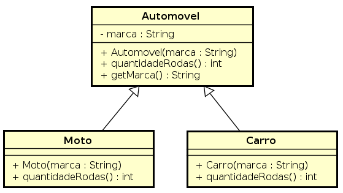
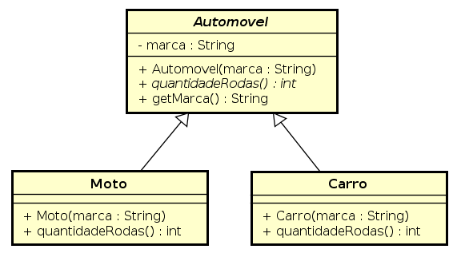

<!SLIDE section center>
# Abstração

<!SLIDE>
# Pilares do Paradigma Orientação a Objetos

Este módulo refere-se a um dos quatro pilares do paradigma orientado a objetos.

* Herança
* Polimorfismo
* **Abstração**
* Encapsulamento

<!SLIDE>
# Hierarquia de Automóveis

Vamos voltar ao exemplo da hierarquia de automóveis apresentado no módulo de Herança.

Nesta hierarquia, a classe Automovel foi criada como forma de abstrair um
conceito geral representado em ambas as classes.

<!SLIDE>
# Classes Abstratas

A forma de representar estes conceitos abstratos é realizado no Paradigma
Orientado a Objetos com **Classes Abstratas**.

.callout **Classes Abstratas** organizam elementos comuns a várias classes. - *James Rumbaugh*

No exemplo, a classe Automovel está fazendo o papel de uma classe abstrata, pois está representando
um conceito abstrato.

<!SLIDE>
# Características e Comportamentos em Comum

Usamos classes abstratas para representar grupos que têm características em comum, mas que diferem em detalhes específicos.

<!SLIDE>
# Classes Abstratas vs Classes Concretas

**Classes Concretas** são as classes que representam, de fato, as entidades modeladas do mundo real.

**Classes Abstratas**, por outro lado, agrupam diversas classes concretas que compartilhem o mesmo conceito
(características e comportamentos).

<!SLIDE>
# Intâncias de Classes

Como Classes Abstratas são classes que servem de modelo para classes concretas ou agrupam 
características e comportamentos em comum, não faz sentido ter instâncias de classes abstratas.

Portanto, classes abstratas não devem e não podem ser instanciadas.

    @@@ Java
    Automovel automovel = new Automovel (); // ERRO DE COMPILAÇÃO
    
    Carro carro = new Carro (); // OK
    Moto moto = new Moto (); // OK
    
    

<!SLIDE>
# Representação em Java

Em Java, utilizamos a palavra-chave *abstract* para declarar uma classe abstrata.

No exemplo, a classe Automovel transformada em classe abstrata fica da seguinte forma:

    @@@ Java
    public abstract class Automovel {
    
      private String marca;
      
      public Automovel (String marca) {
	    this.marca = marca;
	  }  
    }

Desta forma, a classe Automovel não pode ser instanciada.

<!SLIDE>
# Comportamentos abstratos

A classe abstrata implementa as características gerais 
e seus métodos abstratos são implementados nas subclasses com seus detalhes.

<!SLIDE>
# Classes Abstratas vs Classes Concretas

A classe abstrata Automovel

    @@@ Java
    public abstract class Automovel {
    
      private String marca;
      
      public Automovel (String marca) {
	    this.marca = marca;
	  }  
    }

A classe concreta Carro

    @@@Java
    public class Carro extends Automovel {
	  // corpo do código
	}

A classe concreta Moto

    @@@Java
    public class Moto extends Automovel {
	  // corpo do código
	}

<!SLIDE>
# Métodos Abstratos

Se uma classe abstrata definir um método abstrato, as classes concretas devem implementar o método.

    @@@ Java
    public abstract class Automovel {
    
	  private String marca;
	  
	  public Automovel (String marca) {
	    this.marca = marca;
      }
    
	  public abstract int quantidadeRodas ();
    }

<!SLIDE>
# Representação em UML

Nome da classe e nome do método escrito em itálico indica que a classe é abstrata ou o método é abstrato.

<!SLIDE>
# Por que utilizar Classe Abstrata?

Como não podemos instanciar uma classe abstrata, tratar conceitos abstratos desta forma, gera uma maior consistência ao sistema.

A decisão de transformar ou não uma classe em abstrata depende do seu domínio.

<!SLIDE>
# Classes Abstratas

Uma classe abstrata é um recurso que podemos utilizar quando queremos compartilhar funcionalidades em comum entre clases, 
mas não queremos permitir que sejam instanciadas.

<!SLIDE>
# Métodos Abstratos

Métodos abstratos são métodos pertencentes a classes abstratas 
que devem ser declarados sem implementação.

    @@@ Java
   	public abstract String quantidadeRodas ();

<!SLIDE>
# Classes Abstratas

Classes abstratas podem ter zero, um ou mais métodos abstratos.

    @@@ Java
    public abstract class Automovel {
    
	  private String marca;
	  
	  public Automovel (String marca) {
	    this.marca = marca;
      }
    
	  public abstract int quantidadeRodas ();
    }

* Uma classe abstrata declara atributos e comportamentos comuns das várias classes em uma hierarquia.

<!SLIDE>
# Classes Abstratas

* As subclasses devem sobrescrever os métodos abstratos para se tornarem concretas.

<!SLIDE>
# Classe Concreta herdada de Classe Abstrata

    @@@Java
    public class Moto extends Veiculo {
	public Moto (String marca) {
		super (marca);
	}
	public int quantidadeRodas () {
		return 2;
	}

<!SLIDE>
# Classe Concreta herdada de Classe Abstrata

    @@@Java
    public class Carro extends Veiculo {
	public Carro (String marca) {
		super (marca);
	}
	public int quantidadeRodas () {
		return 4;
	}

<!SLIDE>
# Usando Classes abstratas

Uma classe Abstrata não pode ser instanciada

    @@@ Java
	Automovel automovel =  new Automovel (); // ERRO de Compilação!!!!

A instanciação de uma classe concreta pode ser atribuida para uma variável
do mesmo tipo da classe concreta.

    @@@ Java
	Carro carro = new Carro (“Ford”);

E também pode ser atribuída para qualquer classe herdada na hierarquia,
inclusive para a classe abstrata, que no exemplo é a super classe.

    @@@ Java
	Automovel automovel = new Carro (“Ford”);

<!SLIDE>
# Método final

* Não podem ser sobrescritos em uma subclasse

* Métodos final são resolvidos em tempo de compilação, isto é conhecido como vinculação estática.

<!SLIDE>
# Método final

    @@@ Java
    public class Automovel {
    
      // restante do código não apresentado.
      
      public final String getMarca() {
	    return marca;
      }
    }

Errado

    @@@ Java
    public class Moto extends Automovel {
    
      public String getMarca() {
	    return this.marca;
      }
      
    }

<!SLIDE>
# Classes final

* Não podem ser estendidas por uma subclasse

* Todos os métodos em um classe final são implicitamente final.

<!SLIDE>
# Classes final

    @@@Java
    public final class Moto extends Veiculo {
….
}

Errado

    @@@Java
    public final class Triciclo extends Moto {
….
}

<!SLIDE>
# Classe Base em Java

Em Java, todas as classes herdam da classe **Object**.
Class Object is the root of the class hierarchy. Every class has Object as a superclass. All objects, including arrays, implement the methods of this class.

https://docs.oracle.com/javase/8/docs/api/java/lang/Object.html

<!SLIDE>
# Métodos da Classe Object

* possui apenas o construtor padrão

Métodos Importantes
* boolean	equals(Object obj)
Indicates whether some other object is "equal to" this one.

int	hashCode()
Returns a hash code value for the object.

String	toString()
Returns a string representation of the object.

Class<?>	getClass()
Returns the runtime class of this Object.

<!SLIDE>
# Sobreescrita dos Métodos da Classe Object

...

