<!SLIDE section center>
# Associação

<!SLIDE>
# Relacionamento entre Classes

Classes podem estar conectados por algum tipo de relacionamento:

* Herança (Generalização)
* Associação (Delegação)

Os relacionamentos entre as classes representam a interação entre seus objetos.

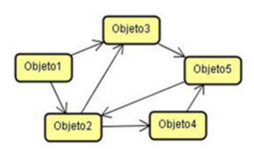

<!SLIDE>
# Associação

Uma associação representa uma conexão que existe entre dois elementos de uma classe, de tal forma que um deve manter alguma referência para o outro.

Uma ligação significa por exemplo que:

* elas “conhecem uma a outra”
* “estão conectadas com”
* para cada X existe um Y

<!SLIDE>
# Associação

Representa o relacionamento (ligação) que é formado entre objetos durante a execução do sistema.

Embora as associações sejam representadas entre classes do diagrama, tais associações representam ligações possíveis entre os objetos das classes envolvidas.

<!SLIDE>
# Classes Empresa e Funcionario

Suponhamos que temos duas classes definidas da seguinte forma:

* Classe: *Empresa* 
 * Características: razão social, cnpj
 * Comportamentos: acessos às características

* Classe: *Funcionario*
 * Características: nome e cpf
 * Comportamentos: acessos às características

<!SLIDE>
# Relacionamento entre Empresa e Funcionario

Gostaríamos de representar o relacionamento entre Empresa e Funcionário.

Neste exemplo, podemos ter o seguinte relacionamento:

.callout Uma Empresa possui um Funcionario.

Podemos também ver este relacionamento sob a ótica de _responsabilidades_.

Neste caso a classe Empresa tem a _responsabilidade_ de saber quem são seus funcionários.

<!SLIDE>
# Representação do Relacionamento

Para representar este tipo de relaciomento, utilizamos a **Associação**.

<!SLIDE>
# Representação UML de Associação

Uma *Associação* simples é representada com uma linha cheia conectando as duas classes.

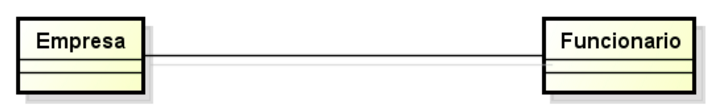

<!SLIDE>
# Nome da Associação e Direção da Leitura

A associação pode ter um nome e uma seta indicando a direção da leitura da associação.

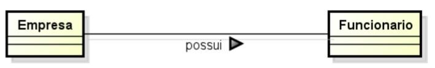

<!SLIDE>
# Papéis na Associação

Cada um dos participantes da associação pode ter um Papel relativo a outra classe

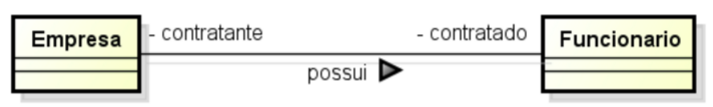

<!SLIDE>
# Nomenclatura Associação

UML define três recursos de notação:

* *Nome da Associação*
 * fornece algum significado semântico à mesma.
* *Direção da Leitura*
 * indica como a associação deve ser lida
* *Papel*
 * representa um papel específico na associação.

<!SLIDE>
# Nomenclatura Associação

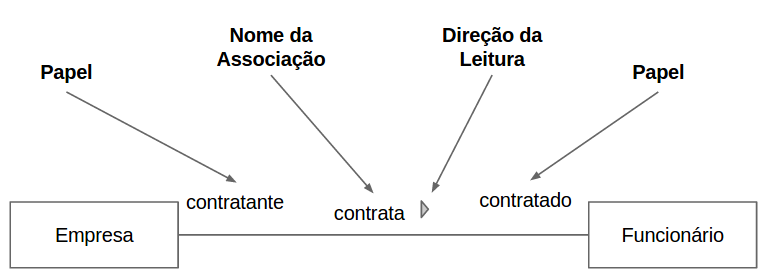

<!SLIDE>
# Cardinalidade (Multiplicidade)

As extremidades da associação podem possuir uma multiplicidade, que especifica o número de objetos de cada classe envolvidos com a associação.

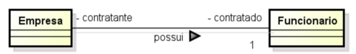

<!SLIDE>
# Cardinalidade (Multiplicidade)
	
Cada associação em um diagrama de classes possui duas multiplicidades, uma em cada extremo da linha da associação.

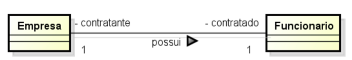

<!SLIDE>
# Tipos de Multiplicidade

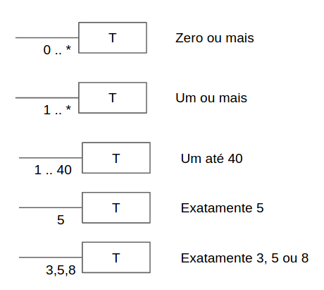

<!SLIDE>
# Exemplo Multiplicidade

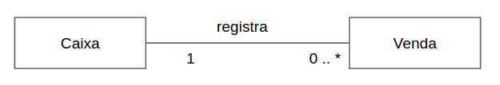

* Uma Caixa pode registrar várias Vendas.
* Uma Venda é registrada em somente uma Caixa.
* Pode haver uma caixa que não registra nenhuma venda.

<!SLIDE>
# Exemplo de Multiplicidade

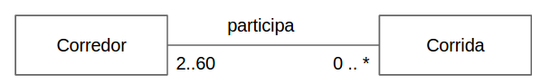

* Uma Corrida está associada a, no mínimo, 2 Corredores
* Uma Corrida está associada a, no máximo, 60 Corredores
* Um Corredor pode estar associado a zero ou mais Corridas

<!SLIDE>
# Exercício
## Relacionamento entre Classes em Java

Alterar as classes Empresa e Funcionário para permitir contratação de Funcionários.

* Empresa possui responsabilidade para devolver a lista de funcionarios contratados.
* A empresa possui a responsabilidade de contratar funcionarios.

<!SLIDE>
# Relacionamento entre Classes em Java

Alterar as classes para que a Empresa possa ter mais de 0 Funcionários.

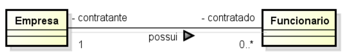

<!SLIDE>
# Atividade Alunos - Laboratório

Desenhar o diagrama de classes UML e escrever o código em Java para o seguinte problema abaixo.

Uma pessoa, caracterizada pelo seu nome e cpf, lê um livro, que possui título e uma Editora, caracterizada por nome e cnpj.

Criar um programa principal que instancie as classes, realize as associações e imprima qual a editora do livro da pessoa.

<!SLIDE>
# Diagrama apenas com as Classes

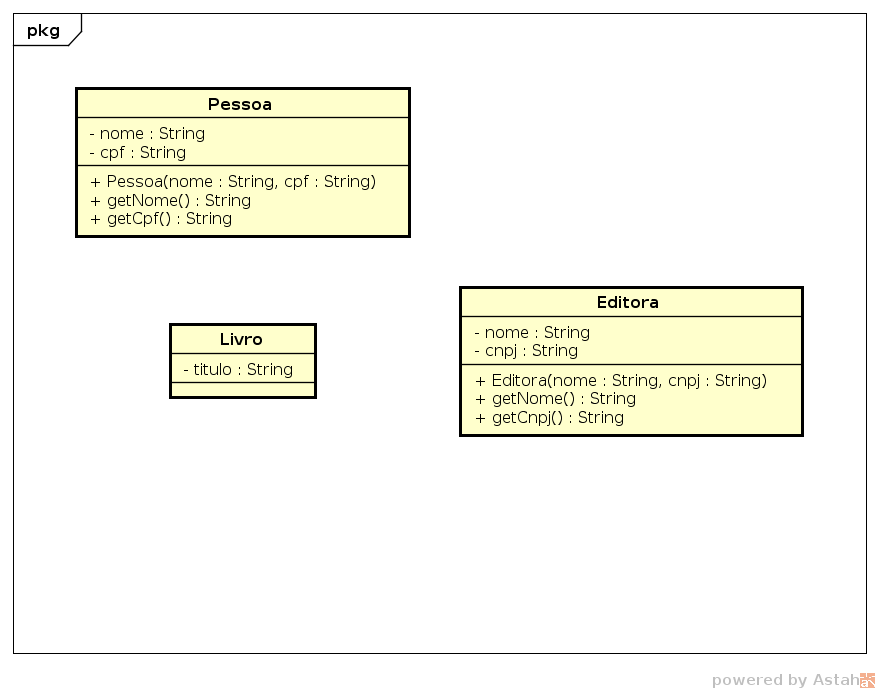

<!SLIDE>
# Diagrama com Associações

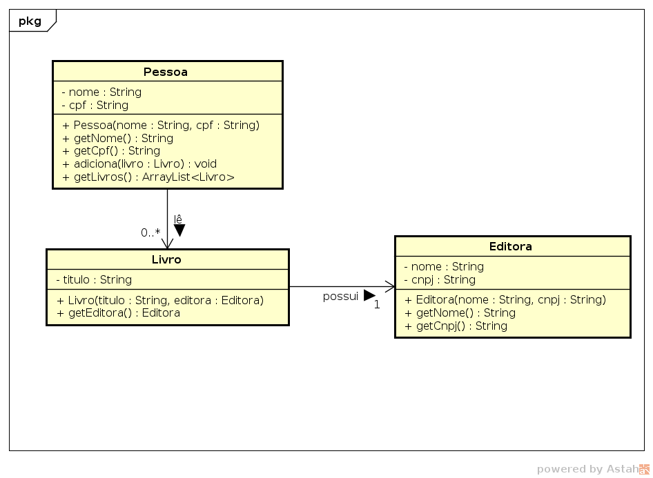

<!SLIDE>
# Classe Funcionario

    @@@ Java
    public class Funcionario {
      private String nome;
      private String cpf;

      public Funcionario(String nome, String cpf) {
        this.nome = nome;
        this.cpf = cpf;
      }

      public String getNome() {
        return nome;
      }

      public String getCpf() {
        return cpf;
      }
    }

<!SLIDE>
# Classe Empresa Multiplicidade 0..*

    @@@ Java
    import java.util.ArrayList;

    public class Empresa {
      private String razaoSocial;
      private String cnpj;

      private ArrayList<Funcionario> funcionarios;

      public Empresa(String razaoSocial, String cnpj) {
        this.razaoSocial = razaoSocial;
        this.cnpj = cnpj;

        this.funcionarios = new ArrayList<Funcionario>();
      }

      // ...  
    }

<!SLIDE>
# Classe Empresa Multiplicidade 1..*

    @@@ Java
    import java.util.ArrayList;

    public class Empresa {
      private String razaoSocial;
      private String cnpj;

      private ArrayList<Funcionario> funcionarios;

      public Empresa(String razaoSocial, String cnpj, 
                     Funcionario funcionario) {
        this.razaoSocial = razaoSocial;
        this.cnpj = cnpj;
		
        this.funcionarios = new ArrayList<Funcionario>();
        contratar(funcionario);
      }
      
      // ...
    }

<!SLIDE>
# Método Contratar

    @@@ Java
    public class Empresa {
      private String razaoSocial;
      private String cnpj;

      private ArrayList<Funcionario> funcionarios;

      public Empresa(String razaoSocial, String cnpj) {
        this.razaoSocial = razaoSocial;
        this.cnpj = cnpj;
		
        this.funcionarios = new ArrayList<Funcionario>();
      }

      public void contratar (Funcionario funcionario) {
        funcionarios.add(funcionario);
      }

      // ...
    }

<!SLIDE>
# Método Contratar

    @@@ Java
    public class Empresa {
      private String razaoSocial;
      private String cnpj;

      private ArrayList<Funcionario> funcionarios;

      public Empresa(String razaoSocial, String cnpj, Funcionario funcionario) {
        this.razaoSocial = razaoSocial;
        this.cnpj = cnpj;
		
        this.funcionarios = new ArrayList<Funcionario>();
        funcionarios.add(funcionario);
      }

      public void contratar (Funcionario funcionario) {
        funcionarios.add(funcionario);
      }

      // ...
    }

<!SLIDE>
# Método Contratar

    @@@ Java
    public class Empresa {
      private String razaoSocial;
      private String cnpj;

      private ArrayList<Funcionario> funcionarios;

      public Empresa(String razaoSocial, String cnpj, Funcionario funcionario) {
        this.razaoSocial = razaoSocial;
        this.cnpj = cnpj;
		
        this.funcionarios = new ArrayList<Funcionario>();
        contratar(funcionario);
      }

      public void contratar (Funcionario funcionario) {
        funcionarios.add(funcionario);
      }

      // ...
    }

<!SLIDE>
# Classe Empresa Multiplicidade 1..*

    @@@ Java
    import java.util.ArrayList;

    public class Empresa {
      private String razaoSocial;
      private String cnpj;

      private ArrayList<Funcionario> funcionarios;

      public Empresa(String razaoSocial, String cnpj, 
                     Funcionario funcionario) {
        this.razaoSocial = razaoSocial;
        this.cnpj = cnpj;
		
        this.funcionarios = new ArrayList<Funcionario>();
        contratar(funcionario);
      }

      public void contratar (Funcionario funcionario) {
        funcionarios.add(funcionario);
      }

      public String getRazaoSocial() {
        return razaoSocial;
      }

      public String getCnpj() {
        return cnpj;
      }

      public ArrayList<Funcionario> getFuncionarios () {
        return funcionarios;
      }
    }

<!SLIDE section center>
# Agregação e Composição

<!SLIDE>
# Agregação e Composição
São casos particulares da relação de Associação.

Representam uma relação: TODO - PARTE

Uma das classes:

* é uma PARTE do TODO 
* ou está contida na outra, o TODO.

<!SLIDE>
# Reaproveitamento de código

Como são casos particulares de **Associação**, a **Composição** e a **Agregação** também são _mecanismos de reaproveitamento de classes_
(reutilização de código).

Conforme já visto, o reaproveitamento de código permite aumentar a _produtividade_ e a _qualidade_ no desenvolvimento de software.

A _produtividade_ é aumentada pois não é necessário reescrever a classe associada, caso ela exista.

A _qualidade_ é obtida pois a classe associada, se existente, já deve ter sido utilizada em outra oportunidade e, portanto, já validada.

<!SLIDE>
# Exemplo Relação TODO - PARTE
	
É possível criar um objeto a partir de vários outros objetos.

Por exemplo, um carro é formado por:

* motor
* rodas
* porta
* direção
* ...

O carro pode ser considerado o **TODO** e motor, rodas, porta, direção como **PARTES** do TODO.

<!SLIDE>
# Herança X Agregação / Composição

_Herança_

* a classe ‘A’ é um tipo da classe ‘B’

_Composição / Agregação_

* a classe ‘A’ contém a classe ‘B’
* a classe ‘A’ usa a classe ‘B’
* a classe ‘B’ é parte da classe ‘A’

<!SLIDE>
# Propriedade Assimétrica

.callout Se um objeto A é parte de um objeto B, B não pode ser parte de A.

Por exemplo:

Um _carro_ (**TODO**) possui _rodas_ (**PARTE**), mas a roda não possui carro.

<!SLIDE>
# Adição e Remoção de Partes

As partes são _criadas_ e _destruídas_ pelo todo, na classe do objeto todo, existem operações para _adicionar_ e _remover_ as partes.

Por exemplo:

Para _incluir_ ou _tirar_ uma _roda_ (**PARTE**) do carro (**TODO**), é necessário operações de adição e remoção na lista de rodas do carro.

<!SLIDE>
# Identificação de Agregação e Composição	

Sejam duas classes associadas X e Y.

Se uma das perguntas a seguir for respondida com um sim, provavelmente há uma agregação onde X é todo e Y é parte.

* X tem um ou mais Y?
* Y é parte de X?

Palavras chaves: consiste em, contém, é parte de, tem, possui, é composta de, faz parte de, etc.

<!SLIDE>
# Características Agregação

* A destruição de um objeto TODO não implica necessariamente a destruição de suas PARTES.

* Um objeto representando a PARTE pode pertencer a mais de um objeto representando o TODO, ou estar contido nele várias vezes.

* O número de partes associadas à classe representando o TODO é variável e pouco importa.

Notação: Losango sem preenchimento

Exemplo: 

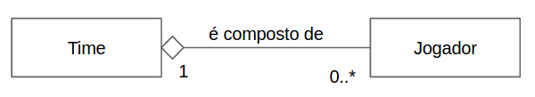

<!SLIDE>
# Características Composição

* A destruição de um objeto TODO implica necessariamente a destruição de suas PARTES.
* Quando o objeto da classe representando o TODO for destruído, os objetos que os compõem necessariamente também serão.
* Um objeto representando a PARTE pertence a um único objeto representando o TODO.
* Não faz sentido pensarmos no objeto da classe representando o TODO sem os objetos que os compõem. 
* O TODO existe enquanto as PARTES também existem.

Notação: Losango com preenchimento

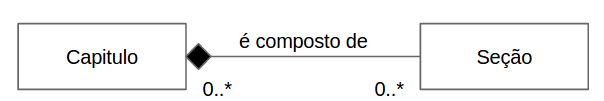

<!SLIDE>
# Exemplo Programa

**Sistema**: Carrinho de Compras de Produtos de Usuário.

**Descrição**: Criar classes para modelar um sistema em que usuários adicionam
produtos em um carrinho para realizar uma compra ao final.

<!SLIDE>
# Identificação de Classes e Relacionamentos

A partir da descrição do problema, podemos identificar algumas classes.

"... em que **usuários** adicionam **produtos** em um **carrinho** para realizar uma compra ao final."

Identificação de Classes:

* **Usuário**
* **Produto**
* **Carrinho**

E também podemos identificar os relacionamentos.

* Um Usuário **possui** um Carrinho de Compras
* Um Carrinho de Compras **contém** produtos

<!SLIDE>
# Maiores Detalhes

Alguns detalhes adicionais sobre o problema são:

* Um usuário pode ter um único carrinho de compras.
* Um carrinho de compras pode ter zero ou mais produtos.
* O carrinho de compras pertence apenas a um usuário e não pode ser reaproveitado.
* O produto adicionado em um carrinho pode ser utilizado posteriormente em outro carrinho.

<!SLIDE>
# Modelagem UML

A partir das informações obtidas anteriormente, podemos montar um _diagrama de clases UML_.

<!SLIDE>
# Modelagem Classes

Podemos iniciar modelando o diagrama apenas com as classes considerando suas características

<!SLIDE>
# Modelagem Usuário x Carrinho de Compras

Agora podemos iniciar adicionar os relacionamento considerando as informações.

<!SLIDE>
# Modelagem Carinho de Compras x Produto

Em seguida, podemos adicionar as operações relacionadas aos relacionamentos.

<!SLIDE>
# Modelagem Completa

A modelagem final poderia ficar da seguinte forma.

<!SLIDE>
# Implementação do Modelo

A partir da modelagem do problema no diagrama de classes UML, podemos
criar as classes em Java

