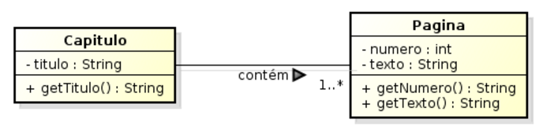

<!SLIDE section center>
# Associação

<!SLIDE>
# Característica Orientação a Objetos

Capacidade de facilitar a Reutilização de Código
* diminui a quantidade de código escrita
* economiza o trabalho do programador
* diminui a possibilidade de erros

Mecanismos de Reuso
* Herança (Generalização)
* Delegação

<!SLIDE>
# Relacionamento entre Classes

Classes podem estar conectados por algum tipo de relacionamento:
* Generalização (Herança)
* Associação (Agregação e Composição)

Os relacionamentos entre as classes representam a interação entre seus objetos.

<!SLIDE>
# Herança
Princípio de Orientação a Objetos que permite a criação de novas classes a partir de outras previamente criadas.

A classe A é superclasse da classe B
A classe B é subclasse da classe A
Todo B é um  A
Classe A é classe Pai de Classe B
Classe B é classe Filha de Classe A

<!SLIDE>
# Polimorfismo

<!SLIDE>
# Associação
Uma associação representa uma conexão que existe entre dois elementos de uma classe, de tal forma que um deve manter alguma referência para o outro.

Uma ligação significa por exemplo que:

* elas “conhecem uma a outra”
* “estão conectadas com”
* para cada X existe um Y

<!SLIDE>
# Associação

Representa o relacionamento (ligação) que é formado entre objetos durante a execução do sistema.

Embora as associações sejam representadas entre classes do diagrama, tais associações representam ligações possíveis entre os objetos das classes envolvidas.

<!SLIDE>
# Relacionamento entre Classes em Java

Criar as classes Empresa e Funcionário para representar que uma Empresa possui um Funcionário.

* Funcionário possui nome e CPF.
* Empresa possui Razão Social, CNPJ e um Funcionario.
* Empresa possui responsabilidade de conhecer o funcionario contratado.

<!SLIDE>
# Representação UML de Associação

Uma *Associação* simples é representada com uma linha cheia conectando as duas classes.

<!SLIDE>
# Nome da Associação e Direção da Leitura

A associação pode ter um nome e uma seta indicando a direção da leitura da associação.

<!SLIDE>
# Papéis na Associação

Cada um dos participantes da associação pode ter um Papel relativo a outra classe

<!SLIDE>
#
##

    @@@Java

<!SLIDE>
# Nomenclatura Associação

UML define três recursos de notação:

* *Nome da Associação*
 * fornece algum significado semântico à mesma.
* *Direção da Leitura*
 * indica como a associação deve ser lida
* *Papel*
 * representa um papel específico na associação.

<!SLIDE>
# Nomenclatura Associação

<!SLIDE>
# Cardinalidade (Multiplicidade)

As extremidades da associação podem possuir uma multiplicidade, que especifica o número de objetos de cada classe envolvidos com a associação.

<!SLIDE>
# Cardinalidade (Multiplicidade)
	
Cada associação em um diagrama de classes possui duas multiplicidades, uma em cada extremo da linha da associação.

<!SLIDE>
# Tipos de Multiplicidade

<!SLIDE>
# Exemplo Multiplicidade

* Uma Caixa pode registrar várias Vendas.
* Uma Venda é registrada em somente uma Caixa.
* Pode haver uma caixa que não registra nenhuma venda.

<!SLIDE>
# Exemplo de Multiplicidade

* Uma Corrida está associada a, no mínimo, 2 Corredores
* Uma Corrida está associada a, no máximo, 60 Corredores
* Um Corredor pode estar associado a zero ou mais Corridas

<!SLIDE>
# Exercício
## Relacionamento entre Classes em Java

Alterar as classes Empresa e Funcionário para permitir contratação de Funcionários.

* Empresa possui responsabilidade para devolver a lista de funcionarios contratados.
* A empresa possui a responsabilidade de contratar funcionarios.

<!SLIDE>
# Relacionamento entre Classes em Java
## Alterar as classes para que a Empresa possa ter mais de 0 Funcionários.

<!SLIDE>
# Atividade Alunos - Laboratório

Desenhar o diagrama de classes UML e escrever o código em Java para o seguinte problema abaixo.

Uma pessoa, caracterizada pelo seu nome e cpf, lê um livro, que possui título e uma Editora, caracterizada por nome e cnpj.

Criar um programa principal que instancie as classes, realize as associações e imprima qual a editora do livro da pessoa.

<!SLIDE>
# Agregação e Composição
São casos particulares da relação de Associação.

Representam uma relação: TODO - PARTE

Uma das classes:

* é uma PARTE do TODO 
* ou está contida na outra, o TODO.

<!SLIDE>
# Agregação e Composição
Mecanismo de reaproveitamento (reutilização) de classes utilizado pela Programação Orientada a Objetos para aumentar a produtividade e a qualidade no desenvolvimento de software.

<!SLIDE>
# Relação TODO - PARTE
	
É possível criar um objeto a partir de vários outros objetos.

<!SLIDE>
# Herança X Composição de Classes

_Herança_

* a classe ‘A’ é um tipo da classe ‘B’

_Composição / Agregação_

* a classe ‘D’ contém a classe ‘C’
* a classe ‘D’ usa a classe ‘C’
* a classe ‘C’ é parte da classe ‘D’

<!SLIDE>
# Característica Agregação e Composição

São assimétricas:
Se um objeto A é parte de um objeto B, B não pode ser parte de A.

<!SLIDE>
# Característica Agregação e Composição

As partes são criadas e destruídas pelo todo, na classe do objeto todo, existem operações para remover e adicionar as partes.

<!SLIDE>
# Identificação de Agregação e Composição	

Sejam duas classes associadas X e Y.

Se uma das perguntas a seguir for respondida com um sim, provavelmente há uma agregação onde X é todo e Y é parte.

* X tem um ou mais Y?
* Y é parte de X?

Palavras chaves: consiste em, contém, é parte de, tem, possui, é composta de, faz parte de, etc.

<!SLIDE>
# Agregação

Tipo especial de associação onde o elemento associado corresponde a uma parte do elemento principal.

<!SLIDE>
# Características Agregação

* A destruição de um objeto Todo não implica necessariamente a destruição de suas Partes.
* Um objeto pode pertencer a mais de um composto, ou estar contido nele várias vezes.

Notação: Losango sem preenchimento

<!SLIDE>
# Composição

Tipo especial de associação onde a parte indicada deve necessariamente existir.

<!SLIDE>
# Características Composição

* A destruição de um objeto Todo implica necessariamente a destruição de suas partes.

* Uma classe pertence a um único composto 

Notação: Losango com preenchimento

<!SLIDE>
# Agregação e Composição

Reaproveitamento (Reutilização)

* Você pode usar uma ou várias classes para compor outro classe.

Aumento de Produtividade

* Está relacionado com a possibilidade de não ser necessário reescrever código de determinadas classes, se alguma já existe com estado (atributos) e comportamento similar.

Aumento de Qualidade

* Há a possibilidade clara de reutilizar classes que já foram usadas em outros sistemas e, portanto, já foram testadas e têm chances de conter menos erros.

<!SLIDE>
# Modelagem Livro

Em um sistema foram identificadas as classes:

* Livro
* Capítulo
* Página

* Um Capítulo deve obrigatoriamente pertencer a um único Livro.
* Um Capítulo contém uma (no mínimo) ou mais Páginas.
* Uma Página não necessariamente precisa pertencer a um capítulo, mas se pertencer, pode ser a mais de um.

<!SLIDE>
# Identificação Classes

<!SLIDE>
#
Um Capítulo deve obrigatoriamente pertencer a um único Livro.

<!SLIDE>
# 

Um Capítulo contém uma (no mínimo) ou mais Páginas.

<!SLIDE>
#

Uma Página não necessariamente precisa pertencer a um capítulo, mas se pertencer, pode ser a mais de um.

<!SLIDE>
# Diagrama de Classes

<!SLIDE>
#

* Criar Capítulo
* Listar Capítulos
* Obter Capítulo

Alterar aplicação teste...

<!SLIDE>
#

* Adicionar uma Página
* Listar Páginas do Capítulo

Alterar aplicação teste...

<!SLIDE>
# Composição

A diferença básica entre uma agregação e uma composição é que, na agregação, o número de partes associadas à classe principal é variável e pouco importa.
Na composição, não faz sentido pensarmos o objeto da classe principal sem os objetos que a compoem. 
O todo existe enquanto as partes também existem.
Quando o objeto da classe principal for destruído, os objetos que o compoem necessariamente também  serão.

