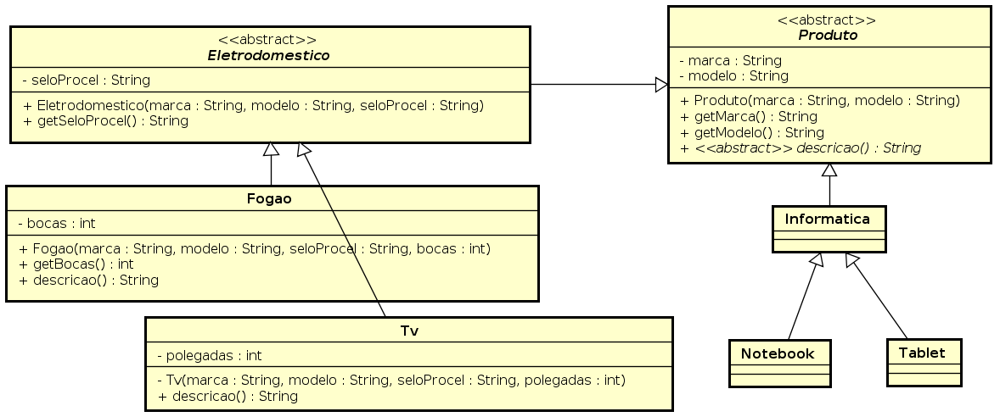

<!SLIDE supplemental hierarquia_produtos_solucao>
# Hierarquia de Classes de Produtos 
## Solução

Produto.java

    @@@ Java
    package produtos;

    public abstract class Produto {

      private String marca;
	  private String modelo;
	
	  public Produto (String marca, String modelo) {
		this.marca = marca;
		this.modelo = modelo;
	  }
	
	  public final String getMarca() {
		return marca;
	  }
	
	  public final String getModelo() {
		return modelo;
	  }
	
	  public abstract String descricao();
	
    }

Eletrodomestico.java

    @@@ Java
    package produtos;

    public abstract class Eletrodomestico extends Produto {

	  private String seloProcel;

	  public Eletrodomestico(String marca, String modelo, String seloProcel) {
		super(marca, modelo);
		this.seloProcel = seloProcel;
	  }

	  public final String getSeloProcel() {
		return seloProcel;
	  }

	  @Override
	  public String descricao() {
		return getMarca() + " " + getModelo() + " " + getSeloProcel();
	  }

    }

Fogao.java

    @@@ Java
    package produtos;

    public final class Fogao extends Eletrodomestico {
	
	  private int bocas;

	  public Fogao (String marca, String modelo, String seloProcel, int bocas) {
		super (marca, modelo, seloProcel);
		this.bocas = bocas;
	  }
	
	  public final int getBocas() {
		return bocas;
	  }

	  @Override
	  public String descricao() {
		return "Fogao "+ super.descricao() + " " + getBocas();
	  }
	  
    }

Tv.java

    @@@ Java
    package produtos;

    public class Tv extends Eletrodomestico {

	  private int polegadas;

	  public Tv(String marca, String modelo, String seloProcel, int polegadas) {
		super(marca, modelo, seloProcel);
		this.polegadas = polegadas;
	  }

	  public final int getPolegadas() {
		return polegadas;
	  }

	  @Override
	  public String descricao() {
		return "Tv " + super.descricao() + " " + getPolegadas();
	  }

    }

ProgramaPrincipal.java

    @@@Java
    package produtos;

    import java.util.ArrayList;

    public class ProgramaPrincipal {

	  public static void main (String[] args) {
		
		Fogao f1 = new Fogao("marcaFogao1", "modeloFogao1", "A", 4);
		Fogao f2 = new Fogao("marcaFogao2", "modeloFogao2", "B", 5);
		Fogao f3 = new Fogao("marcaFogao3", "modeloFogao3", "C", 5);
		
		Tv tv1 = new Tv("marcaTv1", "modeloTv1", "A", 40);
		Tv tv2 = new Tv("marcaTv2", "modeloTv2", "B", 50);
		Tv tv3 = new Tv("marcaTv3", "modeloTv3", "B", 50);
		
		
		ArrayList<Fogao> fogoes = new ArrayList<Fogao>();
		fogoes.add(f1);
		fogoes.add(f2);
		fogoes.add(f3);

		for (int i=0; i<fogoes.size(); i++) {
			Fogao fogao = fogoes.get(i);
			System.out.println(fogao.descricao());
		}
		
		
		ArrayList<Eletrodomestico> eletrodomesticos= new ArrayList<Eletrodomestico>();
		eletrodomesticos.add(f1);
		eletrodomesticos.add(f2);
		eletrodomesticos.add(f3);
		eletrodomesticos.add(tv1);
		eletrodomesticos.add(tv2);
		eletrodomesticos.add(tv3);

		for (int i=0; i<eletrodomesticos.size(); i++) {
			Eletrodomestico eletrodomestico = eletrodomesticos.get(i);
			System.out.println(eletrodomestico.descricao());
		}
		

		ArrayList<Produto> produtos = new ArrayList<Produto>();
		produtos.add(f1);
		produtos.add(f2);
		produtos.add(f3);
		produtos.add(tv1);
		produtos.add(tv2);
		produtos.add(tv3);

		for (int i=0; i<produtos.size(); i++) {
			Produto produto = produtos.get(i);
			System.out.println(produto.descricao());
		}	
	  }	
    }
    
Diagrama de Classes

