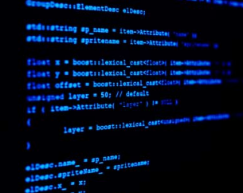

<!SLIDE section center>
# Papel do Compilador em relação do Computador

<!SLIDE>
# Computador

* efetuar cálculos complexos, repetidos, com rapidez e confiabilidade
* entreter com jogos e informações de multimídia
* manipular contas bancárias
* manipular cadastro de alunos
* armazenar e procurar informações em grandes volumes de dados

<!SLIDE>
# Computador

* O que faz um computador ser capaz de efetuar estas tarefas são seus softwares (ou programas de computadores).

O programa diz ao computador o que fazer:

* ler de arquivo
* exibir informações no monitor
* efetuar cálculos usando o processsador
* etc...

**Programas** são _conjuntos de comandos e regras_ que um programador deve conhecer para poder manipular os recursos de um computador.

<!SLIDE>
# Computador

Programas são escritos usando linguagens de programação, que definem regras específicas e bem determinadas e um conjunto de operadores e comandos que podem ser usados.

Colocar imagem

<!SLIDE>
# Código-Fonte

O conteúdo dos programas, escrito por programadores de forma que outros programadores possam ler e entendê-los, também é chamado de código ou código-fonte.

Colocar imagem

<!SLIDE>
# Compilação

Para que o código seja executado por um computador, ele deve ser traduzido da linguagem de programação (alto nível) para uma linguagem que possa ser compreendida pelo computador (baixo nível) através de um compilador.

Colocar imagem
