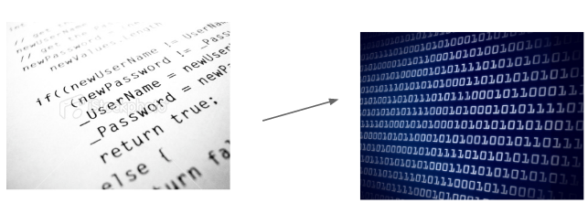

<!SLIDE section center>
# Papel do Compilador em relação do Computador

<!SLIDE incremental>
# Computador

.callout.question O que o computador é capaz de fazer?

* Efetuar cálculos complexos, repetidos, com rapidez e confiabilidade;
* Entreter as pessoas com jogos e informações de multimídia;
* Manipular contas bancárias;
* Manipular cadastro de alunos;
* Asrmazenar e procurar informações em grandes volumes de dados;

<!SLIDE>
# Programa de Computador (Software)

O que faz um computador ser capaz de efetuar tarefas são os Programas de Computadores.

**Programas de Computadores** são _conjuntos de comandos e regras_ que um programador deve conhecer para poder manipular os recursos de um computador.

O programa diz ao computador o que fazer:

* ler de arquivo
* exibir informações no monitor
* efetuar cálculos usando o processsador
* etc...

<!SLIDE>
# Linguagem de Programação

Programas de Computadores são escritos usando _Linguagens de Programação_, que definem regras específicas 
e bem determinadas para que um conjunto de operadores e comandos possam ser utilizados.

<!SLIDE>
# Código-Fonte

O conteúdo dos programas, escrito por programadores de forma que outros programadores possam ler e entendê-los,
também é chamado de código ou _Código-Fonte_.

<!SLIDE>
# Compilação

Para que o código seja executado por um computador, ele deve ser traduzido da linguagem de programação (alto nível)
para uma linguagem que possa ser compreendida pelo computador (baixo nível) através de um compilador.

