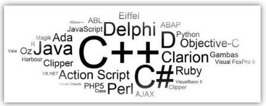

<!SLIDE section center>
# Papel do Compilador em relação do Computador

<!SLIDE>
# Computador

.callout.question O que o computador é capaz de fazer?

<!SLIDE>
# Computador

.callout.question O que o computador é capaz de fazer?

O computador é uma máquina capaz de realizar variados tipos de tratamento automático de informações ou processamento de dados.

Algumas das possíveis capacidades de umm computador são:

* armazenamento de dados
* processamento de dados 
* executa cálculos complexos, repetidos com rapidez e confiabilidade
* realiza tratamento de imagens gráficas
* permite realidade virtual
* possibilita entretenimento e cultura

<i>Fonte: https://pt.wikipedia.org/wiki/Computador</i>

<!SLIDE>
# Programa de Computador (Software)

.callout.question Como o computador realiza estas tarefas?

<!SLIDE>
# Programa de Computador (Software)

.callout.question Como o computador realiza estas tarefas?

O que faz um computador ser capaz de efetuar tarefas são os Programas de Computadores.

**Programas de Computadores** são _conjuntos de comandos e regras_ que um programador deve conhecer para poder manipular os recursos de um computador.

O programa diz ao computador o que fazer:

* ler de arquivo
* exibir informações no monitor
* efetuar cálculos usando o processsador
* etc...

<!SLIDE>
# Linguagem de Programação

.callout.question Como são estes comandos e regras?

<!SLIDE>
# Linguagem de Programação

.callout.question Como são estes comandos e regras?

Programas de Computadores são escritos usando _Linguagens de Programação_, que definem regras específicas 
e bem determinadas para que um conjunto de operadores e comandos possam ser utilizados.

<!SLIDE>
# Código-Fonte

O conteúdo dos programas, escrito por programadores de forma que outros programadores possam ler e entendê-los,
também é chamado de código ou _Código-Fonte_.

<!SLIDE>
# Compilação

.callout.question Como o computador entende os comandos e as regras?

Para que o código seja executado por um computador, ele deve ser traduzido da linguagem de programação (alto nível)
para uma linguagem que possa ser compreendida pelo computador (baixo nível) através de um compilador.

<!SLIDE>
# Execução

Como o programa compilado, o computador consegue entender os comandos e executar a tarefa programa por um ser humano.

