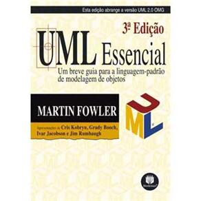
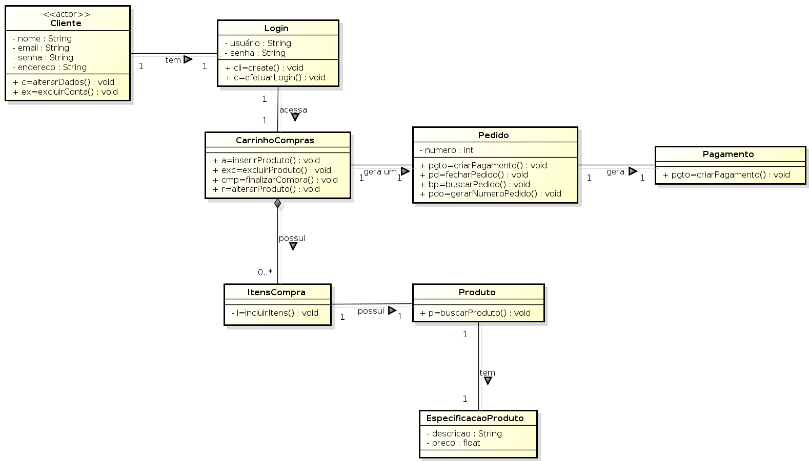

<!SLIDE section center>
# Herança

<!SLIDE>
# Pilares do Paradigma Orientação a Objetos
* **Herança**
* Polimorfismo
* Abstração
* Encapsulamento

<!SLIDE>
# Reutilização de Código

Capacidade de facilitar a Reutilização de Código

* Reduz a quantidade de código para escrever
* Economiza o trabalho do programador
* Diminui a possibilidade de erros

<!SLIDE>
# Mecanismos de Reutilização
* Herança
* Associação

<!SLIDE center>
Vamos criar um programa de computador utilizando o Paradigma Orientado a Objetos ...

<!SLIDE>
# Especificação do Problema

.callout Dado um arquivo com informações de folha de pagamento Criar um programa orientado a objetos que 
imprime o relatório e na última linha aq=

Dado uma empresa 
Analista, coordenador, Gerente
arquivo com
criar um programa que imprime a idade, nome 

<!SLIDE>
# Modelagem do Problema

Uma das primeiras atividades a ser realizada para criar um programa de computador 
A primeira tarefa a ser realizada para criar um programa orientado a objetos
Para criarmos um programa orientado a objetos, 

inicialmente podemos utilizar a especificação do problema como forma de identificar as possíveis classes, seus atributos (características) e seus métodos (comportamento).

<!SLIDE>
# Identificação das Classes
Dado a especificação 
Funcionários podem ser:
Professores
Coordenadores

<!SLIDE>

Possíveis Características da Classe Professor
* nome
* cpf
* salário

Possíveis Características da Classe Coordenador
* nome
* cpf
* salário

<!SLIDE center>
# Como comunicar a solução?

<!SLIDE>
# Unified Modeling Language (UML)
## Linguagem de Modelagem Unificada

UML é uma Linguagem Padrão para:

* Visualização

* Especificação

* Construção

* Documentação

de Software Orientado a Objetos.

<!SLIDE>
# Bibliografia
## UML Essencial: Um breve guia para a linguagem Padrão

**Editora**: Bookman Companhia

**Autor**: Martin Fowler

http://martinfowler.com/books/uml.html

<!SLIDE>
# Visualização

* A existência de um modelo visual facilita a comunicação e faz com que os menbros de um grupo tenham a mesma ideia do sistema.

* Cada símbolo gráfico tem uma semântica bem definida.

<!SLIDE>
# Especificação

É uma ferramenta poderosa para a especificação de diferentes aspectos arquiteturais e de uso de um sistema.

<!SLIDE>
# Construção

* Geração automática de código a partir do modelo visual.
* Geração do modelo visual a partir do código.

Ambientes de desenvolvimento permitem:

* movimentação em ambos os sentiddos
* manutenção da consistência entre as visões

<!SLIDE>
# Documentação

Pode incluir artefatos como:
* Especificação de requisitos do sistema
* Especificações funcionais
* Planos de teste
* Materiais importantes para controlar, medir e refletir sobre um sistema durante o desenvolvimento e a implantação

<!SLIDE>
# Descrição da Arquitetura

UML oferece uma forma padrão para desenhar a Arquitetura de um Sistema.

* Processos de Negócio
* Funcionalidades do Sistema
* Classes
* Esquemas de Banco de Dados
* Componentes de Software
* ...

<!SLIDE>
# Por que Modelar?

* para comunicar a estrutura e o comportamento desejado de um sistema.
* para visualizar e controlar a arquitetura de um sistema.
* para melhorar o entendimento de um sistema expondo oportunidades para melhorias e reutilizações.
* para administrar riscos e trade-offs.

<!SLIDE>
# Diagramas da UML

Diagrama é uma representação gráfica de uma coleção de elementos de um modelo.

São desenhados para permitir a visualização de um sistema sob diferentes perspectivas.

Tipos de Diagramas

* Diagramas estruturais
* Diagramas Comportamentais

<!SLIDE>
# Diagramas Estruturais

Usados para visualizar, especificar, construir e documentar aspectos Estáticos de um sistema.
* Diagrama de Classes
* Diagrama de Objetos
* Diagrama de Pacotes
* Diagrama de Componentes
* Diagrama de Implantação

<!SLIDE>
# Diagrama de Classes

* Oferece uma visão estática da estrutura do sistema.
* Exibe classes e relacionamentos entre elas.

<!SLIDE>
# Para que serve o Diagrama de Classes?

Descreve os tipos de objetos no sistema e os vários tipos de relacionamentos estáticos que podem existir entre eles.

<!SLIDE>
# Diagramas Comportamentais

Usados para visualizar, especificar, construir e documentar aspectos Dinâmicos de um sistema
Diagrama de Casos de Uso
Diagrama de Sequência
Diagrama de Colaboração
Diagrama de Estados
Diagrama de Atividades

<!SLIDE>
# Diagrama de Casos de Uso

<!SLIDE>
# Diagrama de Casos de Uso

Um caso de uso é uma interação típica entre um usuário e um sistema.
Um caso de uso captura alguma função visível ao usuário.
Especificam e documentam o comportamento do sistema.
Importantes para as organizações e para a modelagem de comportamentos do sistema.
Não descreve a organização interna do software.

<!SLIDE>
# Ferramentas CASE

**C**omputer-**A**ided **S**oftware **E**ngineering
Ferramentas computacionais que ajudam nas atividades de engenharia de software.

Exemplos de Ferramentas

* Ferramentas Livres
 * astah community (http://astah.net/editions/community)
 * argoUML (http://argouml.tigris.org/)

* Ferramentas Pagas
 * Visual Paradigm (http://www.visual-paradigm.com/)
 * Enterprise Architect (http://www.sparxsystems.com/products/ea/)

<!SLIDE>
# 
Validar a instalação da Ferramenta nos computadores.

http://astah.net/editions/community

<!SLIDE>
# Para que serve o Diagrama de Classes?

Descreve os tipos de objetos no sistema e os vários tipos de relacionamentos estáticos que podem existir entre eles.

Tipos de relacionamento:

* Subtipos (Herança)

* Delegações (Associações)

<!SLIDE>
# Para que serve o Diagrama de Classes?

Diagramas de classes mostram (comunicam):
* atributos e métodos de uma classe 
* restrições à maneira com que os objetos são conectados

<!SLIDE>
#  Notação UML para Classes

colocar imagem

<!SLIDE>
# Exemplo: Classe Funcionario

colocar imagem

<!SLIDE>
Ferramenta de Modelagem
http://astah.net/editions/community/

colocar imagem

<!SLIDE>
# Diagrama de Classes

imagem de professor coordenador diretor

<!SLIDE center>

Vamos criar as Classes Java a partir do Diagrama UML ...

<!SLIDE>
# Classe Diretor

    @@@Java
    public class Diretor {
        private String nome;
        private String cpf;
        public Diretor (String nome, String cpf) {
            this.nome = nome;
            this.cpf = cpf;
        }
        public void setNome(String nome) {
            this.nome = nome;
        }
        public String getNome() {
            return this.nome;
        }
        public void setCpf(String cpf) {
             this.cpf = cpf;
        }
    }

<!SLIDE>
# Classe Coordenador

    @@@Java
    public class Coordenador {
        private String nome;
        private String cpf;
        public Coordenador (String nome, String cpf) {
            this.nome = nome;
            this.cpf = cpf;
        }
        public void setNome(String nome) {
            this.nome = nome;
        }
        public String getNome() {
            return this.nome;
        }
        public void setCpf(String cpf) {
             this.cpf = cpf;
        }
    }

<!SLIDE>
# Classe Professor

    @@@Java
    public class Professor {
        private String nome;
        private String cpf;
        public Professor (String nome, String cpf) {
            this.nome = nome;
            this.cpf = cpf;
        }
        public void setNome(String nome) {
            this.nome = nome;
        }
        public String getNome() {
            return this.nome;
        }
        public void setCpf(String cpf) {
             this.cpf = cpf;
        }
    }

<!SLIDE>
# Relatório

Criar a classe Relatorio.
No método main:
Instanciar as seguintes classes:
Professor: “Fulano”, “123.456.789-01”, 1000
Coordenador: “Beltrano”, “345.678.901-23”, 2000
Diretor: “Ciclano”, “567.890.123-44”, 3000
2. Imprimir um relatório da seguinte forma:
Fulano (123.456.789-01):  1000
Beltrano (345.678.901-23): 2000
Ciclano (567.890.123-44): 3000

<!SLIDE>
# Relatório

    @@@Java
    public class Relatorio {
        public static void main (String[] args) {
            Professor p
            
            System.out.println();
        }
    }
    

Fulano (123.456.789-01):  1000
Beltrano (345.678.901-23): 2000
Ciclano (567.890.123-44): 3000

<!SLIDE>
# Alguns problemsa
* repetição
* manutenção

<!SLIDE>
# Herança

Princípio de Orientação a Objetos que permite a criação de novas classes a partir de outras previamente criadas.
Atributos e métodos podem ser reaproveitados.

imagem

A classe A é 
classe genérica
classe base
superclasse
classe mãe

A classe B é
classe especializada
classe derivada
subclasse
classe filha

<!SLIDE>
# Nomenclatura de Herança

A classe A é superclasse da classe B
A classe B é subclasse da classe A
Todo B é um  A
Classe A é classe Pai de Classe B
Classe B é classe Filha de Classe A

imagem

<!SLIDE>
# Herança

Representa o relacionamento É UM

imagem

Exemplos:
carro é um veículo
livro é uma publicação

<!SLIDE>
# Herança

Generalização 

Especialização

<!SLIDE>
# Melhorando a Modelagem do Exemplo

Usando o Princípio da Herança,
Como poderíamos melhorar esta solução (modelagem)?

<!SLIDE>
# Remodelagem do Exemplo

colocar imagem

Professor É UM Funcionário
Coordenador É UM Funcionário
Diretor É UM Funcionário

<!SLIDE>
# Em Java
# Palavra reservada extends para representar herança

imagem e código

repetição eliminada
manutenção facilitada

<!SLIDE>
# Relatório

código novamente.

<!SLIDE>
# Funcionários na Universidade

Funcionário
* nome
* cpf
* salário

Tipos de Funcionários

* Professor
 * tipo contratação
* Coordenador
 * departamento
* Segurança
 * período

<!SLIDE>
# Funcionários na Universidade

Funcionário 1: Professor
nome: Fulano
cpf: 111.111.111-11
salário: 1.000
tipo contratação: CLT

Funcionário 2: Coordenador
nome: Beltrano
cpf: 222.222.222-22
salário: 2.000
departamento: Computação

Funcionário 3: Segurança
nome: Ciclano
cpf: 333.333.333-33
salário: 3.000
período: Noturno

<!SLIDE>
# Um slide para falar que vamos ver as possibilidades para resolver o problemas

<!SLIDE>
# Modelagem - 1a. opção

Adicionar os atributos em uma classe e deixar os atributos vazios quando necessário.

colocar imagem

Fica estranho...

Porque fica estranho?

atributos podem não ser utilizados
difícil determinar qual o tipo de funcionário

<!SLIDE>
# Modelagem - 2a. opção
Criar classes iguais com os parâmetros iguais e adicionais.

incluir imagem

Fica estranho também ...

Porque fica estranho?

* classes iguais
* atributos repetidos
* atributos não utilizados

<!SLIDE>
# Modelagem - 3a. opção

Utilizar Herança, ou seja, criar uma classe pai e herdar os atributos e métodos

colocar imagem

Esta modelagem parece melhor...

Porque?

* classes diferentes
* atributos não se repetem

<!SLIDE>
# Herança Simples x Múltipla

Herança Múltipla: uma classe herda métodos e campos de duas classes simultaneamente.
Herança Simples: uma classe herda métodos e atributos de uma única classe pai.
Não existe mecanismo de Herança Múltipla em Java.
Exemplo:

colocar imagem

<!SLIDE incremental>
# Benefícios da Herança
## É usada na intenção de:
* reaproveitar código
* reaproveitar comportamento generalizado
* especializar operações
* reaproveitar atributos

<!SLIDE>
# Modificadores de Acesso

São padrões de visibilidade de acesso às classes, atributos e métodos.

Controlam como as classes e seus membros são visíveis por outras classes.

<!SLIDE>
# Níveis de Modificadores de Acesso 

Java possui 4 níveis de controle de acesso, que são aplicados a classes, atributos e métodos.
* private 
* package (default)
* protected
* public

<!SLIDE>
# Modificador public

Uma declaração com este modificador pode ser acessada de qualquer lugar e por qualquer entidade.
Representação em UML - símbolo + (mais)

    @@@Java
    public class Funcionario {
	public String nome;

	public Funcionario (String nome) {
		this.nome = nome;
	}

	public String getNome() {
		return this.nome;
	}
}

    @@@Java
    public static void main (String[] args) {
	Funcionario f = new Funcionario();
	String nome = f.getNome();
	nome = f.nome;
}

 
<!SLIDE>
# Modificador private

Membros da classe (atributos ou métodos) não podem ser acessados nem utilizados por nenhuma outra classe. Não se aplica às classes.
Representação em UML - símbolo - (menos)

    @@@Java
    public class Funcionario {
	private String nome;

	public Funcionario (String nome) {
		this.nome = nome;
	}

	private String getNome() {
		return this.nome;
	}
}

    @@@Java
    public static void main (String[] args) {
	Funcionario f = new Funcionario();
	String nome = f.getNome();
	nome = f.nome;
}

 
<!SLIDE>
# Modificador de Acesso - protected

Este modificador permite que os membros (atributos e métodos) da classe estejam acessíveis às classes do mesmo pacote ou através de herança.
Representação em UML - símbolo # (cerquilha)

colocar imagem

 
<!SLIDE>
# Modificador default

A classe e seus membros (atributos e métodos) são acessíveis somente por classes do mesmo pacote.
Não há palavra-chave associada em Java e é utilizado quando o modificador não é especificado.
Representação em UML - símbolo ~ (til)

Veremos exemplos na aula de pacotes.

 
<!SLIDE>
# Notação UML para Classes

colocar imagem

Os modificadores são representados no diagrama pelos símbolos ~, +, - e # que devem ser colocados antes dos atributos e métodos.

default (ou package) - símbolo ~ (til)
	Não há palavra-chave associada em Java e é utilizado quando o modificador não é especificado.

<!SLIDE>
# Notação UML para Classes

 
<!SLIDE>
# Tabela de Modificadores de Acesso

<!SLIDE>
# Proteção de Atributos

Em Orientação a Objetos, é comum proteger os atributos da classe com o modificador private.
Uma classe é responsável pelo controle de acesso de seus atributos e métodos.
O modificador private impede que outras classes acessem diretamente atributos da classe indevidamente.

<!SLIDE>
#
Classe Funcionario com atributo salário e método aplicarBonus.

    @@@Java
    public class Funcionario {
	public double salario;

	public Funcionario (double salario) {
		this.salario = salario;
	}

	public void aplicarBonus() {
		// Aumento de 30%
		this.salario = 1.3 * this.salario;

	public double getSalario () {
		return this.salario;
	}
}

<!SLIDE>
#

Alterando salário do Funcionário...

    @@@Java
    public class Funcionario {
  public double salario;
  
  public Funcionario (double salario) {
    this.salario = salario;
  }

  public void aplicarBonus() {
    // Aumento de 30%
    this.salario = 1.3 * this.salario;
  }

  public double getSalario () {
    return this.salario;
  }
}

Salário: 2.000

    @@@Java
    public static void main (String[] args) {
  Funcionario f = new Funcionario(1.000);
  f.salario = 2.0 * f.salario;
  System.out.println (“Salário: “ + f.getSalario());
}

<!SLIDE>
#

Como impedir que o salário do Funcionário seja aumentado mais que o bônus?

    @@@Java
    public class Funcionario {
  public double salario;
  
  public Funcionario (double salario) {
    this.salario = salario;
  }

  public void aplicarBonus() {
    // Aumento de 30%
    this.salario = 1.3 * this.salario;
  }

  public double getSalario () {
    return this.salario;
  }
}

Salário: 2.000

    @@@Java
    public static void main (String[] args) {
  Funcionario f = new Funcionario(1.000);
  f.salario = 2.0 * f.salario;
  System.out.println (“Salário: “ + f.getSalario());
}

    
    
    
    
<!SLIDE>
#
Utilização do Modificador Correto.

    @@@Java
    public class Funcionario {
  private double salario;
  
  public Funcionario (double salario) {
    this.salario = salario;
  }

  public void aplicarBonus() {
    // Aumento de 30%
    this.salario = 1.3 * this.salario;
  }

  public double getSalario () {
    return this.salario;
  }
}

Salário: 2.000

    @@@Java
    public static void main (String[] args) {
  Funcionario f = new Funcionario (1.000);
  //f.salario = 2.0 * f.salario; //ERRO
  f.aplicaBonus();
  System.out.println (“Salário: “ + f.getSalario());
}

<!SLIDE>
#
Como impedir que o salário do Funcionário seja aumentado mais que o bônus?

    @@@Java
    public class Funcionario {
	public double salario;

	public Funcionario (double salario) {
		this.salario = salario;
	}

	public void aplicaBonus() {
		// Aumento de 30%
		this.salario = 1.3 * this.salario;

	public double getSalario () {
		return this.salario;
		
	}
}

Salário: 2.000

    @@@Java
    public static void main (String[] args) {
Funcionario f = 
  			new Funcionario(1.000);
f.salario = 2.0 * f.salario;
System.out.println (“Salário: “ +
				f.getSalario());
}

    
    

<!SLIDE>
#
Restringindo o acesso ao atributo salario da classe Funcionario.

    @@@Java
    public class Funcionario {
	private  double salario;

	public Funcionario (double salario) {
		this.salario = salario;
	}

	public void aplicaBonus() {
		// Aumento de 30%
		this.salario = 1.3 * this.salario;

	public double getSalario () {
		return this.salario;
	}
}

Salário: 1.300

    @@@Java
    public static void main (String[] args) {
Funcionario f = 
 			new Funcionario (1.000);
//f.salario = 2.0 * f.salario; //ERRO
f.aplicaBonus();
System.out.println (“Salário: “ +
				f.getSalario());
}

<!SLIDE>
#

<!SLIDE>
#

<!SLIDE>
#

.download herança/herança.txt

<!SLIDE form=heranca>
# Making Acquaintances
## Let's get to know each other

Tell me a little bit about yourself to help me better tailor the classroom
experience towards your needs.

ha -> ha? = () Sim (=) Não

hb -> hb? = (=) Sim () Não

~~~SECTION:notes~~~

~~~FORM:heranca~~~

~~~ENDSECTION~~~
