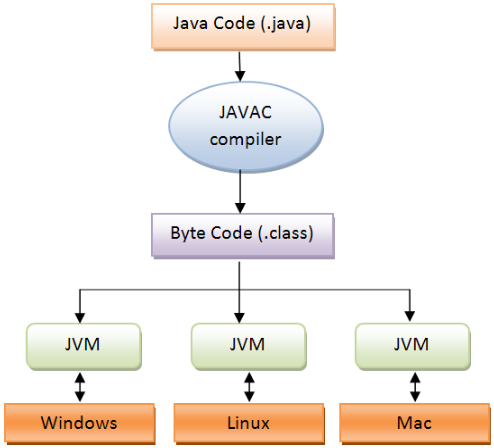

<!SLIDE section center>
# Linguagem de Programação Java

<!SLIDE>
# O que é Java?
* Uma Linguagem de Programação Orientada a Objetos
* Um ambiente de Desenvolvimento
* Uma ambiente de Execução  

<!SLIDE>
# Por que Java?
* Orientada a Objetos
* Simples (sintaxe concisa)
* Portátil (independente de plataforma)
* Mecanismo de Gerenciamento de Memória
* Bibliotecas Prontas

<!SLIDE>
# Características

* Robusta
 * Tipagem de dados forte
 * Checagem automática
 * Tratamento de Exceções

* Independente de arquitetura de Hardware

<!SLIDE>
# Garbage Collection - Coletor de Lixo

##

* Não é necessário se preocupar com alocação de memória.
* Memória alocada não mais necessária deve ser desalocada
* Verifica e libera memória que não está sendo utilizada

~~~SECTION:notes~~~
Em outras linguagens, desalocar área de memória é responsabilidde do programador
http://javabook.compuware.com/content/memory/how-garbage-collection-works.aspx
~~~ENDSECTION~~~

  
<!SLIDE>
# Máquina Virtual Java

* Fornece especificações da plataforma de hardware
* Interpreta bytecodes que são independentes de plataforma
* É implementada em uma ferramanta de desenvolvimento da tecnologia Java ou em um navegador web

    
<!SLIDE>
# Máquina Virtual Java

    
<!SLIDE>
# Ambiente de Execução Java

* Tarefas principais
1. Carrega
2. Verifica
3. Interpreta
4. Executa
    
<!SLIDE>
# Ambiente de Execução Java

    
<!SLIDE>
# Palavras Reservadas da Linguagem Java
## Lista completa

<table border=1>
 <tr>
   <td>abstract</td>
   <td>boolean</td>
   <td>break</td>
   <td>byte</td>
   <td>case</td>
   <td>catch</td>
 </tr>
 <tr>
   <td>char</td>
   <td>class</td>
   <td>const</td>
   <td>continue</td>
   <td>default</td>
   <td>do</td>
 </tr>
 <tr>
   <td>double</td>
   <td>else</td>
   <td>extends</td>
   <td>final</td>
   <td>finally</td>
   <td>float</td>
 </tr>
 <tr>
   <td>for</td>
   <td>goto</td>
   <td>if</td>
   <td>implements</td>
   <td>import</td>
   <td>instanceof</td>
 </tr>
 <tr>
   <td>int</td>
   <td>interface</td>
   <td>long</td>
   <td>native</td>
   <td>new</td>
   <td>package</td>
 </tr>
 <tr>
   <td>private</td>
   <td>protected</td>
   <td>public</td>
   <td>return</td>
   <td>short</td>
   <td>static</td>
 </tr>
 <tr>
   <td>strictfp</td>
   <td>super</td>
   <td>switch</td>
   <td>synchronized</td>
   <td>this</td>
   <td>throw</td>
 </tr>
 <tr>
   <td>throws</td>
   <td>transient</td>
   <td>try</td>
   <td>void</td>
   <td>volatile</td>
   <td>while</td>
 </tr>
 <tr>
   <td>assert</td>
   <td></td>
   <td></td>
   <td></td>
   <td></td>
   <td></td>
 </tr> 
</table>

.callout.info Total de 49 palavras reservadas
    
<!SLIDE>
# Palavras Reservadas da Linguagem Java
## Lista das palavras utilizadas no curso

<table border=1>
 <tr>
   <td><b>abstract</b></td>
   <td><b>boolean</b></td>
   <td><b>break</b></td>
   <td><b>byte</b></td>
   <td><b>case</b></td>
   <td><b>catch</b></td>
 </tr>
 <tr>
   <td><b>char</b></td>
   <td><b>class</b></td>
   <td><b>const</b></td>
   <td><b>continue</b></td>
   <td><b>default</b></td>
   <td><b>do</b></td>
 </tr>
 <tr>
   <td><b>double</b></td>
   <td><b>else</b></td>
   <td><b>extends</b></td>
   <td><b>final</b></td>
   <td><b>finally</b></td>
   <td><b>float</b></td>
 </tr>
 <tr>
   <td><b>for</b></td>
   <td>goto</td>
   <td><b>if</b></td>
   <td><b>implements</b></td>
   <td><b>import</b></td>
   <td><b>instanceof</b></td>
 </tr>
 <tr>
   <td><b>int</b></td>
   <td><b>interface</b></td>
   <td><b>long</b></td>
   <td>native</td>
   <td><b>new</b></td>
   <td><b>package</b></td>
 </tr>
 <tr>
   <td><b>private</b></td>
   <td><b>protected</b></td>
   <td><b>public</b></td>
   <td><b>return</b></td>
   <td><b>short</b></td>
   <td><b>static</b></td>
 </tr>
 <tr>
   <td>strictfp</td>
   <td><b>super</b></td>
   <td><b>switch</b></td>
   <td>synchronized</td>
   <td><b>this</b></td>
   <td><b>throw</b></td>
 </tr>
 <tr>
   <td><b>throws</b></td>
   <td>transient</td>
   <td><b>try</b></td>
   <td><b>void</b></td>
   <td>volatile</td>
   <td><b>while</b></td>
 </tr>
 <tr>
   <td>assert</td>
   <td></td>
   <td></td>
   <td></td>
   <td></td>
   <td></td>
 </tr> 
</table>

.callout.info 42 palavras reservadas utilizadas no curso.
	

.callout.info 7 palavras reservadas não vistas no curso.

<!SLIDE>
# Download Java

http://www.oracle.com/technetwork/java/javase/downloads/jdk8-downloads-2133151.html

<!SLIDE>
# Install Java

https://docs.oracle.com/javase/8/docs/technotes/guides/install/install_overview.html

<!SLIDE>
# Java Runtime Environment (JRE) 	

<!SLIDE>
# Java Development Kit (JDK). 

<!SLIDE>
# IDE
## Integrated Development Environment

* Eclipse - https://eclipse.org/
* NetBeans - https://netbeans.org/
* IntelliJ - https://www.jetbrains.com/idea/

* http://www.drjava.org/
* http://www.bluej.org/
* http://www.jcreator.com/
* Oracle JDeveloper - http://www.oracle.com/technetwork/developer-tools/jdev/overview/index.html
* http://jgrasp.org/

https://en.wikipedia.org/wiki/Integrated_development_environment

<!SLIDE>
# Método Main

O método main é um método estático especial, usado como ponto de partida de um programa Java.

    @@Java
    public static void main (String [] args) {
        // implementação
    }
    
* O array de strings é a lista de argumentos da linha de comando;

* Pode-se declarar métodos main em qualquer classe.

<!SLIDE>
# Impressão de Valores
##

Para imprimir textos na saída padrão em Java, chamamos o métodos:
void System.out.println (String texto);
Imprime um texto e pula uma linha.
void System.out.print (String texto);
Imprime um texto, mas não pula linha.
Saída Padrão: Tela

    @@Java
    System.out.println (“Hello World!”);
    
    @@Java
    System.out.println (“Hello World!”);

<!SLIDE>
# Exemplo
## HelloWorld

    @@Java
    public class HelloWorld {
	    public static void main (String[ ] args) {
            System.out.println(“Hello World!”);
        }
    }
    
  
<!SLIDE>
# Compilando um programa Java

Compilação do arquivo HelloWorld.java
Programa para compilação: javac

javac HelloWorld.java

Faz com que seja compilado automaticamente.
É gerado o arquivo

	HelloWorld.class

    
<!SLIDE>
# Executando um Programa Java

Execução do arquivo HelloWorld.class
Programa para execução: java

java HelloWorld

Faz com que o programa seja executado.
O método main da classe é executado.

