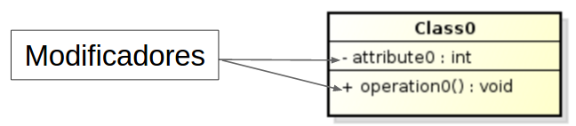

<!SLIDE section center>
# Modificadores de Acesso

<!SLIDE>
# Modificadores de Acesso

São padrões de visibilidade de acesso às classes, atributos e métodos.

Controlam como as classes e seus membros são visíveis por outras classes.

O Modificador de Acesso também pode ser referenciado como Restrição de Acesso.

<!SLIDE>
# Níveis de Modificadores de Acesso 

Java possui 4 níveis de controle de acesso, que são aplicados a classes, atributos e métodos.

* private 
* package (default)
* protected
* public

<!SLIDE>
# Aplicação dos Modificadores de Acesso

Os modificadores de acesso podem ser aplicados em diversos lugares:

* classe

* atributo

* método

O exemplo a seguir possui o modificar público para todos os lugares.
	
    @@@ Java
    public class Funcionario {
    	public String nome;

	    public Funcionario (String nome) {
		    this.nome = nome;
	    }

	    public String getNome() {
		    return this.nome;
	    }
    }

<!SLIDE>
# Modificador Público

Uma declaração com este modificador pode ser acessada de qualquer lugar e por qualquer objeto.

Em Java, o modificador público é realizado pela palavra reservada **public**.

<!SLIDE>
# Modificador Público na Classe

<!SLIDE>
# Modificador Público no Atributo

<!SLIDE>
# Modificador Público no Método

    @@@Java
    public static void main (String[] args) {
	    Funcionario f = new Funcionario();
	    String nome = f.getNome();
	    nome = f.nome;
    }

<!SLIDE>
# Modificador private
## Membros da classe (atributos ou métodos) não podem ser acessados nem utilizados por nenhuma outra classe. Não se aplica às classes.

Representação em UML - símbolo - (menos)

    @@@Java
    public class Funcionario {
    	private String nome;

	    public Funcionario (String nome) {
		    this.nome = nome;
	    }

	    private String getNome() {
		    return this.nome;
	    }
    } 

xxx

    @@@Java
    public static void main (String[] args) {
    	Funcionario f = new Funcionario();
	    String nome = f.getNome();
	    nome = f.nome;
    }

<!SLIDE>
# Modificador de Acesso - protected
## Este modificador permite que os membros (atributos e métodos) da classe estejam acessíveis às classes do mesmo pacote ou através de herança.

Representação em UML - símbolo # (cerquilha)

<!SLIDE>
# Modificador default
A classe e seus membros (atributos e métodos) são acessíveis somente por classes do mesmo pacote.

Não há palavra-chave associada em Java e é utilizado quando o modificador não é especificado.

Representação em UML - símbolo ~ (til)

.callout.info Veremos exemplos na aula de pacotes.

<!SLIDE>
# Notação UML para Classes

Os modificadores são representados no diagrama pelos símbolos ~, +, - e # que devem ser colocados antes dos atributos e métodos.

default (ou package) - símbolo ~ (til)
	Não há palavra-chave associada em Java e é utilizado quando o modificador não é especificado.

<!SLIDE>
# Notação UML para Classes

<!SLIDE>
# Tabela de Modificadores de Acesso

<table>
  <tr><th>Visibilidade</th><th>private</th><th>default</th><th>protected</th><th>public</th></tr>
  <tr><td>mesma classe</td><td>SIM</td><td>SIM</td><td>SIM</td><td>SIM</td></tr>
  <tr><td>mesmo pacote</td><td>NÃO</td><td>SIM</td><td>SIM</td><td>SIM</td></tr>
  <tr><td>pacotes diferentes (subclasses)</td><td>NÃO</td><td>NÃO</td><td>SIM</td><td>SIM</td></tr>
  <tr><td>pacotes diferentes (sem subclasses)</td><td>NÃO</td><td>NÃO</td><td>NÃO</td><td>SIM</td></tr>
</table>

<!SLIDE>
# Proteção de Atributos

Em Orientação a Objetos, é comum proteger os atributos da classe com o modificador private.

Uma classe é responsável pelo controle de acesso de seus atributos e métodos.

O modificador private impede que outras classes acessem diretamente atributos da classe indevidamente.

<!SLIDE>
# 
Classe Funcionario com atributo salário e método aplicarBonus.

    @@@Java
    public class Funcionario {
	public double salario;

	public Funcionario (double salario) {
		this.salario = salario;
	}

	public void aplicarBonus() {
		// Aumento de 30%
		this.salario = 1.3 * this.salario;

	public double getSalario () {
		return this.salario;
	}
}

<!SLIDE>
# 
Alterando salário do Funcionário...

    @@@Java
    public class Funcionario {
  public double salario;
  
  public Funcionario (double salario) {
    this.salario = salario;
  }

  public void aplicarBonus() {
    // Aumento de 30%
    this.salario = 1.3 * this.salario;
  }

  public double getSalario () {
    return this.salario;
  }
}

Salário: 2.000

    @@@ Java
    public static void main (String[] args) {
  Funcionario f = new Funcionario(1.000);
  f.salario = 2.0 * f.salario;
  System.out.println (“Salário: “ + f.getSalario());
}

<!SLIDE>
# 

Como impedir que o salário do Funcionário seja aumentado mais que o bônus?

<!SLIDE>
# 
Utilização do Modificador Correto.

    @@@Java
    public class Funcionario {
  private double salario;
  
  public Funcionario (double salario) {
    this.salario = salario;
  }

  public void aplicarBonus() {
    // Aumento de 30%
    this.salario = 1.3 * this.salario;
  }

  public double getSalario () {
    return this.salario;
  }
}

salario 2000

    @@@Java
    public static void main (String[] args) {
  Funcionario f = new Funcionario (1.000);
  //f.salario = 2.0 * f.salario; //ERRO
  f.aplicaBonus();
  System.out.println (“Salário: “ + f.getSalario());
}

<!SLIDE>
# 
Restringindo o acesso ao atributo salario da classe Funcionario.

    @@@Java
    public class Funcionario {
	private  double salario;

	public Funcionario (double salario) {
		this.salario = salario;
	}

	public void aplicaBonus() {
		// Aumento de 30%
		this.salario = 1.3 * this.salario;

	public double getSalario () {
		return this.salario;
	}
}

salario: 1300

    @@@Java
    public static void main (String[] args) {
Funcionario f = 
 			new Funcionario (1.000);
//f.salario = 2.0 * f.salario; //ERRO
f.aplicaBonus();
System.out.println (“Salário: “ +
				f.getSalario());
}

<!SLIDE>
# Exemplo Modificador de Acesso

Classe A (classe mãe)
 
Classe B (classe filha de A no mesmo pacote)
 
 Classe C (classe filha de A em pacote diferente)

<!SLIDE>
# Representações na UML

Representação em UML - símbolo + (mais)
