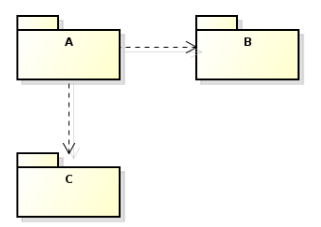
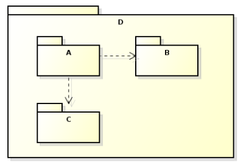

<!SLIDE section center>
# Pacotes

<!SLIDE center>

.callout.question Como quebrar um sistema grande em pequenos?

.callout.question Como pequenos pedaços podem interagir formando um sistema?

.callout.question Como podemos dar manutenção nestas pequenas partes de projeto?

<!SLIDE>
# 
Uma possível solução seria agrupar as classes em unidades de nível mais alto.

Em programação este recurso é chamado de Pacote ou Namespace.

<!SLIDE>
# Packages

Java provê um mecanismo de agrupamento de classes em pacotes.
Packages (ou pacotes) criam escopos para declaração de clases.

    @@@Java
    package instrumentos;

    public class Teclado {
	    void tocar ();
    } 

ssss

    @@@Java
    package perifericos;

    public class Teclado {
	    char ultimaTecla ();
    }

<!SLIDE>
# Packages

A Package faz parte do nome da classe.

    @@@Java
    instrumentos.Teclado ti = new instrumentos.Teclado ();
    perifericos.Teclado tp = new perifericos.Teclado ();

    ti.tocar ();
    char c = tp.ultimaTecla();

<!SLIDE>
# Packages

É possível importar todas as classes de uma package ou apenas uma classe específica;

    @@@Java
    import nome.da.package.*;
    import nome.da.package.NomeDaClasse;

<!SLIDE>
# Packages

Arquivos com declaração de package devem ter estrutura de diretório especial.
Package: exemplo
Diretório: exemplo/

Package: br.senac.sp
Diretório: br/senac/sp

<!SLIDE>
# Diagrama de Pacotes

O Diagrama de Pacotes definido pela UML descreve os pacotes em pedaços do sistema divididos em agrupamentos lógicos mostrando as dependências entre estes, ou seja, pacotes podem depender de outros pacotes.

<!SLIDE>
# Notação

Pacotes se relacionam através das suas dependências.

<!SLIDE>
# Ocorrências do Diagrama

Na verdade, não existe propriamente diagramas de pacotes em UML. Pacotes e relações entre pacotes aparecem em outros diagramas.

* Pacotes de Casos de Uso

* Pacotes de Classes

* Pacotes de Componentes

* Pacotes de Nós (Diagrama de Implantação)
