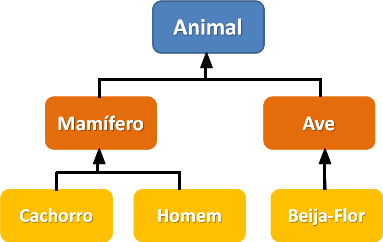
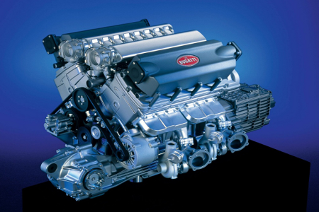

<!SLIDE section center>
# Paradigma de Programação Orientado a Objetos

<!SLIDE section >
# Definição

A Programação Orientada a Objetos (POO) é um paradigma de Programação de Computadores que utiliza o  conceito de Objetos como elementos centrais para representar e processar dados usados nos programas.

<!SLIDE incremental>
# Histórico

* **Final da década de 1960**: surgimento dos primeiros conceitos de POO.
* **1968**: Primeiras Ideias de Orientação a Objetos (Linguagem Simula-68)
 * Linguagem Simula-68 introduziu os conceitos de objetos e mensagens para a construção de programas.
* **Década de 70**: Criação do Termo Programação Orientada a Objetos
  * Criador do termo: Alan Kay
* **Década de 70**: Criação da Linguagem Smalltalk
 * Desenvolvida no laboratório de pesquisa da Xerox, EUA.
* **Década de 90**: Popularização do Paradigma
 * Influência grande das Linguagens C++ e Java

<!SLIDE>
# Características Orientadas a Objetos

.callout.question Quais as caracteríscas devem existir em uma Linguagem de programação para identificá-la como Orientada a Objetos?

Esta questão gerou muita controvérsia nos Anos 80.

<!SLIDE incremental>
# Características Orientadas a Objetos
##  Artigo OOPSLA

De acordo com o artigo OOPSLA (publicado em 1987), de Peter Wegner, para uma linguagem ser Orientada a Objetos ela precisa:

* Ser baseada em Objetos
* Ser baseada em Classes
* Permitir Herança

Dimensions of object-based language design (http://dl.acm.org/citation.cfm?id=38823)

<!SLIDE incremental>
# Características Orientadas a Objetos
## Outras Opiniões

Além das anteriores, alguns autores também consideram que as seguintes características devem estar presentes em uma linguagem orientada a objetos:

* Vinculação dinâmica (late binding)
* Coleta automática de lixo (garbage collection)
* Herança múltipla
* Agregação

<!SLIDE>
# Linguagens

 * C++
 * C#
 * Java
 * Groovy
 * Objective C
 * R
 * Ruby (multiparadigma)
 * Scala (Multiparadigma)
 * Simula
 * Smalltalk
 * ...
 

<i>Fonte: https://pt.wikipedia.org/wiki/Categoria:Linguagens_de_programação_orientadas_a_objetos</i>

<!SLIDE>
# Conceitos POO

No Paradigma de Orientação a Objetos, um programa é visto como um **conjunto de objetos** que se comunicam através de mensagens.

Um programa OO possui objetos que colaboram entre si, executando tarefas específicas em busca de um objetivo comum.

<!SLIDE>
# Pilares
A POO está sedimentada sobre 4 Pilares.

* **Polimorfismo**
* **Herança**
* **Abstração**
* **Encapsulamento**

<!SLIDE>
# Herança

Mecanismo pelo qual uma classe pode derivar de outra classe, aproveitando seus comportamentos e estados.

Os animais são divididos em uma hierárquia de categorias, sendo que a mais inferior herda a classificação das categorias superiores.

<!SLIDE>
# Polimorfismo

Princípio pelo qual classes derivadas de uma mesma superclasse podem invocar método que têm a mesma identificação mas comportamento distintos

Todos animais emitem algum som, mas cada animal possui sua forma de emitir som.

<!SLIDE>
# Encapsulamento

Consiste na separação de aspectos internos e externos de um objeto.

	
Não é necessário saber como funciona internamente um motor para utilizá-lo.

http://techblog.desenvolvedores.net/2011/01/17/encapsulamento-poo/

<!SLIDE>
# Abstração

É a habilidade de concentrar nos aspectos essenciais de um contexto qualquer, ignorando características menos importantes.

Quando um médico torna-se especialista em algum órgão do nosso corpo, ele abstrai sem desconsiderar as influências dos outros órgãos e foca apenas sua atenção nesse órgão.

<!SLIDE>
# Princípio da Abstração

Operação intelectual que consiste em isolar, por exemplo um conceito, um elemento à exclusão de outros, do qual então se faz a abstração.
                                          Fonte: wikipedia

Trata-se da capacidade de abstrair a complexidade de um sistema e se concentrar em apenas partes desse sistema.
ignorar aspectos não relevantes.
capacidade de focalizar o essencial e ignorar detalhes não relacionados com o objetivo estabelecido.

<!SLIDE>
# Abstraindo

Escrever um modelo para representar uma carro.

imagem...

<!SLIDE>
# Abstraindo

Escrever um modelo para representar um carro de brinquedo que será vendido na loja.

imagem...

<!SLIDE>
# Abstraindo

Escrever um modelo para representar um carro que será utilizado em uma concessionária.

imagem...

<!SLIDE>
# Objetos

São utilizados para representar entidades do mundo real ou computacional.

São usados para representar aqueles elementos e abstrações que fazem parte da solução do programa que está sendo desenvolvido.

Imagens de exemplo slide 12

<!SLIDE>
# Objetos

Muitas entidades ou abstrações podem ser representadas como objetos em um programa de computador.

Por exemplo, pessoas e carros podem ser vistos como objetos.

Imagens de exemplo slide 13

<!SLIDE>
# Objetos
## Características

Objetos possuem características pelas quais os identificamos e finalidades para as quais os utilizamos.

.callout Características = Atributos

Imagens de exemplo slide 14

<!SLIDE>
# Objetos
## Comportamentos

Objetos possuem comportamentos associados.

.callout Comportamentos = Métodos

<!SLIDE>
# Objetos

Objetos possuem:
* Características (atributos)
* Comportamentos (métodos)

<!SLIDE>
# Classes

De forma geral, pensamos e organizamos o mundo segundo a nossa visão das características e finalidades da coisas.
Ou seja, pensamos Orientado a Objetos.

É comum criar grupos de objetos com base nas suas características e comportamentos.

<!SLIDE>
# Classes

Universo de objetos Carro.
Todos possuem mesmas características e compotamentos.

Características
* tipo
* cor
* número de portas

Comportamentos
* acelerar
* frear
* ligar
* desligar

<!SLIDE>
# Classes

A modelagem de um conjunto de objetos que possuem características e comportamentos em comum é realizada usando o conceito de Classe.

Cada Classe funciona como um molde para a criação de um Objeto.

Os Objetos são vistos como representações concretas (instâncias) da Classe.

<!SLIDE>
#

Imagens slide 20 

<!SLIDE>
# Classes

Uma Classe define o comportamento de seus objetos através de métodos e os estados possíveis destes objetos através de atributos.

Cada Classe contém dados, bem como o conjunto de métodos que manipulam seus dados.

A instância de uma classe é chamada de objeto.

<!SLIDE>
# Comparação de Paradigmas
## Localização dos Dados

Estruturado
rotinas e funções de fornecedores espalhadas por todo sistema como em contas a pagar, contas a receber e cadastro.

OO
objetos de fornecedores
funções agrupadas apenas no objeto

<!SLIDE>
# Comparação de Paradigmas
## Acessibilidade dos Dados

Estruturado
Na hipótese de alterar algum dado, função ou propriedade, todo sistema deverá ser analisado para identificar o que foi afetado

OO
propriedades, funções e rotinas do objeto fornecedor estão todas em um único objeto, encapsulados, facilitando as futuras alterações.

<!SLIDE>
# Comparação Paradigmas
## Reutilização de Código

Estruturado
É possível porém, às vezes, é necessário utilizar o “copiar e colar”

OO
com a utilização de relacionamentos entre objetos a reutilização de código é muito facilitada

<!SLIDE>
# Vantagens Orientação a Objetos
* Organização do código
* Concentra responsabilidades
* Encapsula lógica de negócios
* Outras vantagens durante o curso...

<!SLIDE>
# Desvantagens Orientação a Objetos
* Maior esforço na modelagem quando comparado com linguagem estruturada (porém, menor esforço de codificação).
* Outras desvantagens durante o curso...

<!SLIDE>
# Principais Conceitos
## Linguagens Orientadas a Objetos

https://pt.wikipedia.org/wiki/Orientação_a_objetos

<!SLIDE>
# Classe
Representa um conjunto de objetos com características afins.
Uma classe define o comportamento dos objetos em seus métodos e quais estados ele é capaz de manter com seus atributos.

<!SLIDE>
# Objeto
Objeto ou instâncias de uma classe.
É capaz de armazenar estados através de seus atributos e reagir a mensagens enviadas a ele, assim como se relacionar e enviar mensagens a outros objetos.

<!SLIDE>
# Atributos
São características de um objeto. Trata-se da estrutura de dados que vai representar a classe. 
Por sua vez, os atributos possuem valores. 
O conjunto de valores dos atributos de um determinado objeto é chamado de estado.

<!SLIDE>
# Método
Definem as habilidades dos objetos.
Um método em uma classe é apenas uma definição. 
A ação só ocorre quando o método é invocado através do objeto.

<!SLIDE>
# Mensagem
É uma chamada a um objeto para invocar um de seus métodos, ativando um comportamento descrito por sua classe.

<!SLIDE>
# Herança (ou Generalização)
Mecanismo pelo qual uma classe (sub-classe) pode estender outra classe (super-classe), aproveitando seus comportamentos (métodos) e variáveis possíveis (atributos).

<!SLIDE>
# Associação
Mecanismo pelo qual um objeto utiliza os recursos de outro. 

<!SLIDE>
# Encapsulamento
Consiste na separação de aspectos internos e externos de um objeto. Este mecanismo é utilizado amplamente para impedir o acesso direto ao estado de um objetos (seus atributos), disponibilizando externamente os métodos que acessam ou alteram seus estados.

<!SLIDE>
# Abstração
É a habilidade de concentrar nos aspectos essenciais de um contexto qualquer, ignorando características menos importantes.

<!SLIDE>
# Polimorfismo
Princípio pelo qual duas ou mais classes derivadas de uma mesma superclasse podem invocar método que têm a mesma identificação (assinatura) mas comportamento distintos, especializados para cada classe.

<!SLIDE>
# Interface
É um "contrato", relacionado a comportamento, estabelecido entre a classe e o mundo externo (quem a utiliza). 

<!SLIDE>
# Pacotes (ou Namespaces)
São referências para organização lógica de classes e interfaces.

Dimensions of Object-Based Language Design 
Peter Wegner 
Department of Computer Science 
Brown University 
168 OOPSLA ‘87 Proceedings October 4-8,1987 S	
http://www.cse.msu.edu/~stire/cse891/wegner.pdf

Concepts and Paradigms of Object-Oriented Programming 
Expansion of Oct 400PSLA-89 Keynote Talk 
Peter Wegner, Brown University 
http://www.cs.technion.ac.il/users/yechiel/Hassava/OOP-material/1990--p7-wegner.pdf

