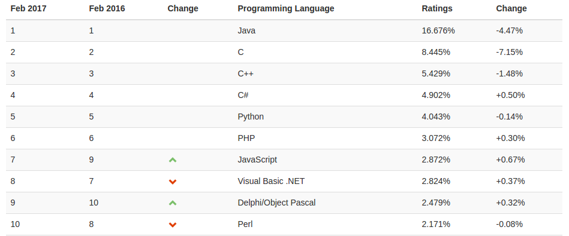

<!SLIDE section center>
# Paradigmas de Programação

<!SLIDE>
# O que é um Paradigma?

***Dicionário Michaelis*** (http://michaelis.uol.com.br/)

.callout Modelo, Padrão, Protótipo.

***Wikipedia*** (https://pt.wikipedia.org/wiki/Paradigma)

.callout Paradigma é um conceito que define um exemplo típico ou modelo de algo. É representação de um padrão a ser seguido.

<!SLIDE>
# Paradigma de Programação

Determina a visão que o programador possui sobre a estruturação e execução do programa.

É a maneira como pensamos e como iremos fazer nossos programas.

~~~SECTION:notes~~~
Um paradigma de programação fornece e determina a visão que o programador possui sobre a estruturação e execução do programa. Por exemplo, em programação orientada a objetos, programadores podem abstrair um programa como uma coleção de objetos que interagem entre si, enquanto em programação funcional os programadores abstraem o programa como uma sequência de funções executadas de modo empilhado.
~~~ENDSECTION~~~

<!SLIDE>
# Classificação
## Paradigmas de Programação

Há diversas formas de classificar os paradigmas de programação.

<!SLIDE>
# Classificação
## Paradigmas de Programação

De acordo com o Wikipedia, podem ser classificados em:

* Procedural
* Orientado a Objetos
* Funcional
* Lógico
* entre outros  ...

<i>Fonte: https://pt.wikipedia.org/wiki/Paradigma_de_programação</i>

<!SLIDE>
# Classificação
## Paradigmas de Programação

De acordo com a ACM, podem ser classificados em:

* Execução
 * Sequencial
 * Concorrente
* Programação
 * Imperativo
 * Declarativo

.callout ACM (Association for Computing Machinery) http://www.acm.uiuc.edu/signet/JHSI/cr.D.3.2.html

<!SLIDE>
# Paradigma Sequencial

* Uma computação é realizada após o término da anterior.
* Controle de fluxo de execução interno ao programa

<!SLIDE>
# Paradigma Concorrente

* Múltiplas computações podem ser executadas simultaneamente
 * Computações Paralelas
 * Múltiplos Processadores compartilham memória
* Computações Distribuídas
 * Múltiplos Computadores conectados por uma rede de comunicação

<!SLIDE>
# Programação Imperativa
* Linguagens expressam sequências de comandos que realizam transformações sobre dados.

<!SLIDE>
# Programação Declarativa
* Linguagens que não possuem conceitos de 
 * sequências de comandos
 * atribuição
* Linguagens Funcionais
 * ênfase em valores computados por funções

* Linguagens Lógicas
 * ênfase em axiomas lógicos

<!SLIDE>
# Paradigmas Imperativos

* Procedural
 * Programas são executados por chamadas sucessivas e procedimentos separados.
 * Exemplos: Fortran e Basic.
 
* Orientação a Objetos
 * Suportam Interação entre Objetos.
 * Exemplo: C++, Java, Python e Ruby.

<!SLIDE>
# Paradigmas Declarativos

* Funcional
 * Um programa especifíca uma relação ou uma função.
 * Não possuem atribuições ou dados mutáveis. Um programa é uma função, que é composto de outras funções.
 * Exemplo: List e ML.

* Programação Lógica
 * Um programa implementa uma relação.
 * Exemplo: Prolog.

<!SLIDE>
# Índice TIOBE Fevereiro 2017

Indicador da popularidade das linguagens de programação. 

As classificações são baseadas no número de engenheiros qualificados em todo o mundo, cursos e fornecedores de terceiros. 

Os motores de busca populares tais como Google, Bing, Yahoo !, Wikipedia, Amazon, YouTube e Baidu são usados para calcular as avaliações. 

<i>Fonte: http://www.tiobe.com/tiobe-index/</i>

<!SLIDE>
# Quanto à estrutura de tipos

* Fracamente Tipadas
 * Tipo da variável muda dinamicamente conforme situação.
 * Exemplo: PHP

* Fortemente Tipada
 * Uma vez atribuído, o tipo da variável não é alterado.
 * Exemplo: Java

<!SLIDE>
# Quanto à estrutura de Tipos

* Dinamicamente Tipada
 * Tipo da variável é definido em tempo de execução.
 * Exemplo: Perl

* Estaticamente Tipada
 * Tipo da variável é definido em tempo de compilação.
 * Exemplo: Java

<!SLIDE>
# Grau de Abstração
Os paradigmas de programação podem ser classificados quanto ao grau de abstração.

* Baixo Nível
 * Símbolos são uma representação direta do código de máquina que será gerado.
 * Exemplo: Assembly.

* Médio Nível
 * Símbolos podem ser convertidos diretamente para o código de máquina.
 * Exemplo: C, C++.

* Alto Nível
 * Símbolos mais complexos, compreensível pelo ser humano e não-executável diretamente pela máquina.
 * Exemplo: Pascal e Java.

<!SLIDE>
# Linguagens de Programação de Baixo Nível
Símbolos são uma representação direta do código de máquina que será gerado.

Exemplo de Linguagens: Assembler

Exemplo de Código Assembler
    @@@armasm
    section .text
    global _start
     _start:
        mov     edx,len
        mov     ecx,msg
        mov     ebx,1
        mov     eax,4
        int     0x80
        mov     eax,1
       int     0x80
    section     .data
    msg     db  'Hello, world!',0xa
    len     equ $ - msg

<i>Fonte: http://asm.sourceforge.net/intro/hello.html</i>

