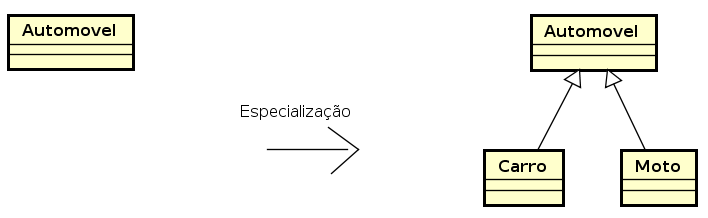
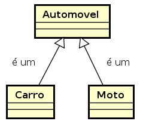
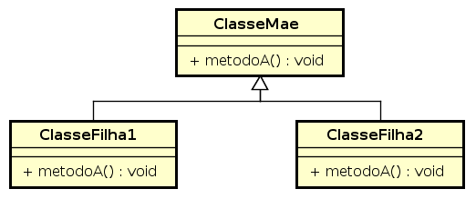

<!SLIDE section center>
# Polimorfimo

<!SLIDE>
# Pilares do Paradigma Orientação a Objetos

Este módulo refere-se a um dos quatro pilares do paradigma orientado a objetos.

* Herança
* **Polimorfismo**
* Abstração
* Encapsulamento

<!SLIDE>
# Relação É-UM na Herança

Conforme já abordado, o mecanismo de **Herança** permite a criação de classes a partir de outras já existentes.

O relacionamento entre estas classes é do tipo **É-UM**.

A partir de uma mesma classe genérica, classes mais especializadas podem ser criadas.

<!SLIDE>
# Especialização de Classes

.callout A relação **É-UM** entre classes permite a existência de outra característica 
fundamental no paradigma programação orientada a objetos: o **Polimorfismo**

Por exemplo, no diagrama de classes abaixo, as classes _Carro_ e _Moto_ são 
classes especializadas da classe _Automovel_, cujo relacionamento **É-UM** é válido.

* _Carro_ é um _Automovel_
* _Moto_ é um _Automovel_

<!SLIDE>
# O que é Polimorfismo?

.callout Polimorfismo é o princípio pelo qual duas ou mais classes derivadas de uma mesma superclasse 
podem invocar métodos que têm a _mesma identificação_ (assinatura) mas _comportamentos distintos_, 
especializados para cada classe derivada.

<!SLIDE>
# Significado 

Na _Língua Portuguesa_:

* Palavra de origem grega que significa "várias formas"
* (poli = muitas; morphos = formas)

No _Paradigma Orientado a Objetos_:

* Várias formas de se executar um determinado comportamento.

<!SLIDE>
# Herança e Polimorfismo

.callout **Polimorfismo** está diretamente ligado a **Herança** de classes.

A ligação ocorre porque os comportamentos diferentes são implementados nas classes filhas.

<!SLIDE>
# Exemplo Polimorfismo

Considere o seguinte diagrama de classes.

* as classes ClasseFilha1 e ClasseFilha2 herdam da classe ClasseMae.
* as classes ClasseFilha1 e ClasseFilha2 possuem o mesmo método metodoA()

<!SLIDE>
# Implementação do Diagrama de Classes

    @@@ Java
    public class ClasseMae {
        public void metodoA() {
            System.out.println("metodoA executado na ClasseMae");
        }
    }
    
    public class ClasseFilha1 extends ClasseMae {
        public void metodoA() {
            System.out.println("metodoA executado na ClasseFilha1");
        }
    }
    
    public class ClasseFilha2 extends ClasseMae {
        public void metodoA() {
            System.out.println("metodoA executado na ClasseFilha2");
        }
    }

<!SLIDE>
# Exemplo Polimorfismo

O polimorfismo ocorre em conjunto com a herança quando dois métodos
possuem a mesma assinatura.

    @@@ Java
    public static void main (String[] args) {
        ClasseFilha1 cf1 = new ClasseFilha1();
        ClasseFilha1 cf2 = new ClasseFilha2();
        
        cf1.metodoA();
        cf2.metodoA();
    }

Tratam-se de chamadas de métodos normais em duas classes.

    @@@ Console
    metodoA executado na ClasseFilha1
    metodoA executado na ClasseFilha2
    

O detalhe ocorre por causa do método ser o mesmo e as classes serem filhas
da mesma classe.

    
<!SLIDE>
# Formas de Execução Diferentes

O Polimorfismo permite que métodos com a mesma assinatura produzam resultados diferentes, dependendo do objeto ao qual é aplicado.

A mesma chamada de método (ou envio de mensagem para um objeto) pode produzir “muitas formas” de resultados.

Conforme mostrado anteriormente, podemos ter dois objetos realizando chamada para um mesmo método.

    @@@ Java
    cf1.metodoA();
    cf2.metodoA();
    
Contudo, o resultado pode ser diferente.

    @@@ Console
    metodoA executado na ClasseFilha1
    metodoA executado na ClasseFilha2

<!SLIDE>
# Programação Genérica vs Específica

.callout O **Polimorfismo** permite programar de forma genérica em vez de programar de forma específica.

Para compreender melhor o que é programar de forma genérica e o que é programar de 
forma específica, vamos continuar com o exemplo das classes filhas da classe Automovel.

<!SLIDE>
# Coleções de Objetos

Para mostrar os benefícios de programar de forma genérica, 
trabalharemos com coleções de objetos.

A linguagem Java possui uma classe responsável por armazenar coleções de objetos. 

_Observação_: Entraremos em maiores detalhes sobre coleções mais adiante.

<!SLIDE>
# Declaração da Classe ArrayList 

Em Java, a classe **ArrayList** é uma opção representar uma coleção de objetos. 

Como a linguagem Java é fortemente tipada e a classe ArrayList aceita apenas
um único tipo de objeto, é necessário indicar do que a coleção será composta.

No nosso exemplo, temos instâncias de Carro e de Moto. Portanto, precisamos de 
duas coleções, uma coleção de instâncias da classe Carro e outra da classe Moto.

A declaração fica da seguinte forma

    @@@ Java
    ArrayList<Carro> carros = new ArrayList<Carro>();
    ArrayList<Moto> motos = new ArrayList<Moto>();

Coloca-se Carro ou Moto entre os caracteres '<' e '>' para indicar sobre 
o que é a coleção.

<!SLIDE>
# Adição de objetos na Coleção

Para adicionar instâncias da classe Carro, 
utiliza-se o método **add** da classe **ArrayList**.

    @@@ Java
    Carro carro1 = new Carro();
    Carro carro2 = new Carro();
    
    ArrayList<Carro> carros = new ArrayList<Carro>();

	carros.add(carro1);
	carros.add(carro2);
	

<!SLIDE>
# Programar de Forma Específica

Suponha que em uma determinada parte do código foram criadas instâncias da Classe Carro da Classe Moto.

    @@@ Java
    Carro carro1 = new Carro();
    Carro carro2 = new Carro();

    Moto moto1 = new Moto();
    Moto moto2 = new Moto();

Se desejarmos criar uma coleção dos automóveis, precisaremos criar duas coleções da seguinte forma:

    @@@ Java
    ArrayList<Carro> carros = new ArrayList<Carro>();
	carros.add(carro1);
	carros.add(carro2);
    
    ArrayList<Moto> motos = new ArrayList<Moto>();
	motos.add(moto1);
	carros.add(moto2);

<!SLIDE>
# Programar de Forma Específica

Se for necessário criar uma nova classe filha de automóvel, por exemplo, a classe **QuadriCiclo**.

    @@@ Java
    public class Quadriciclo extends Automovel {
      
    }
    
também será necessário criar outra coleção para armazenar instâncias desta classe.

    @@@ Java
    Quadriciclo quadriciclo1 = new Quadriciclo();
    Quadriciclo quadriciclo2 = new Quadriciclo();

    ArrayList<Quadriciclo> quadriciclos = new ArrayList<Quadriciclo>();
	quadriciclos.add(quadriciclo1);
	quadriciclos.add(quadriciclo2);

<!SLIDE>
# Acessando elementos de uma coleção

Para iterar em uma coleção, precisamos saber a quantidade de elementos. O método
**size()** da classe **ArrayList** é responsável por esta informação

    @@@ Java
    int size = quadriciclos.size();
    
A cada iteração precisamos pegar um elemento da coleção com o método **get(i)**, 
onde _i_ é a posição do elemento na coleção.

    @@@ Java
    int i = 0;
    Quadriciclo quadriciclo = quadriciclos.get(i);

Uma estrutura **for** fica desta forma:

    @@@ Java    
    for (int i=0; i<quadriciclos.size(); i++) {
      Quadriciclo quadriciclo = quadriciclos.get(i);
    }

<!SLIDE>
# ...

Mostrar os elementos da coleção exige que se crie uma estrtura para cada tipo.

    @@@ Java
    
e para quando uma nova classe é adicionada, também é necesário criar uma nova estrutura.

    @@@ Java

<!SLIDE>
# Programar de Forma Específica

O programar de forma específica é utilizar as classes específicas de 
uma hierarquia de classes para programar.

No exemplo apresentado, queríamos representar a coleção dos automóveis.

Não conseguimos, foi necessário criar uma nova coleção.

Um dos problemas de programar de forma específica é a necessidade de 
fazer o tratamento específico para cada classe específica que surgir, 
gerando um aumento da quantidade de código para escrever.

.callout A manutenção neste caso é muito grande. Incluir novos tipos de 
automóveis exige um certo trabalho e criação de estruturas adicionais.

<!SLIDE>
# Programar de Forma Genérica

.callout.question Como resolver este problema?

Se queremos uma coleção de automóveis, podemos utilizar o conceito da 
Herança e adicionar um carro na coleção de automóveis, dado que um 
carro é um automóvel.

Para isto, precisamos criar uma coleção de automóveis:

    @@@ Java
    ArrayList<Automovel> autos = new ArrayList<Automovel>();

E adicionar o carro na lista

    @@@ Java
    Carro carro = new Carro();
    
    autos.add(carro);
    

    
<!SLIDE>
# Mais explicações sobre Polimorfismo

Desta forma, o Polimorfismo também pode ser visto com a capacidade de tipos mais abstratos 
repesentarem comportamentos de tipos mais específicos.

Polimorfismo é a capacidade de um objeto poder ser referenciado de várias formas.

<!SLIDE>
# Mais explicações sobre Polimorfismo

Com o polimorfismo, podemos projetar e implementar sistemas que são facilmente extensíveis
 
novas classes podem ser adicionadas a partes gerais do programa com pouca ou nenhma modificação, contanto que as novas classes façam parte da hierarquia de herança ue o programa processa genericamente.

<!SLIDE>
# Mais explicações sobre Polimorfismo

Capacidade de uma referência de variável mudar seu comportamento de acordo com o objeto a que ela está conectada.

<!SLIDE>
# Resumo das Características do Polimorfismo

* As classes fazem a mesma operação (método), mas de forma diferente.

* Ocorre quando um método definido no ancestral é redefinido no descendente com um comportamento diferente.

* Todo método definido em um ancestral pode ser acessado através dos descendentes.

* As classes fazem a mesma operação (método), mas de forma diferente.

Polimorfismo permite a manipulação de instâncias de classes que herdam de uma mesma classe ancestral de forma unificada: 

<!SLIDE>
# Tipos de Polimorfismo

* **Sobreposição** ou **Sobrescrita** (_overriding_)

* **Sobrecarga** (_overloading_)

<!SLIDE>
# Sobreposição (Overriding)

* A implementação do método na Classe Filha redefine (ou sobrepõe) a implementação
do mesmo método (mesma assinatura) definido na Classe Mãe.

* A escolha de qual classe o método será executado é realizada em tempo de execução.

* Mesma assinatura significa ter o mesmo nome do do método com a mesma lista de tipos de parâmetros.
* O tipo do retorno não importa na assinatura do método. Não é possível ter dois métodos com 
nomes iguais e mesma lista de tipos de parâmetros de entrada e mesmo tipo de retorno.

<!SLIDE>
# Exemplo Sobreposição (Overriding)

Considerando a hierarquia de classes de automóveis, o trecho de código
abaixo apresenta o método _quantidadeRodas()_ implementado na classe mãe 
e na classe filha.

    @@@ Java
    public class Automovel {
        //...
        public int quantidadeRodas () {
            return 0;
        }
    }    
    public class Carro extends Automovel {
        // ...
        public int quantidadeRodas () {
            return 4; // método sobreescrito
        }
    }
            

<!SLIDE>
# Exemplo Sobreposição (Overriding)

Uma chamada para o método na instância de Automovel

    @@@ Java
    Automovel auto = new Automovel ();
    System.out.println ("Quantidade: "+auto.quantidadeRodas);            

Teria como resultado:

    @@@ Console
    Quantidade: 0;
       

<!SLIDE>
# Exemplo Sobreposição (Overriding)
            
Uma chamada para o método na instância de Carro

    @@@ Java
    Carro auto = new Carro ();
    System.out.println ("Quantidade: "+auto.quantidadeRodas);

Teria como resultado:

    @@@ Console
    Quantidade: 4;
       
    

<!SLIDE>
# Tipos de polimorfismo

* Sobrecarga (overloading)
ocorre na mesma classe ou entre classe-mãe e classe-filha
os métodos diferem pela assinatura (ordem e número de parâmetros)
a escolha do método ocorre em tempo de compilação

* Sobreposição (overriding)
métodos na clase-filha que redefinem ou sobrepõem o comportamento do mesmo método da classe-mãe.
Apresenta a  mesma lista de parâmetros.
Existe também a sobreposição (ou implementação) de métodos concretos (classe-filha) em métodos abstratos (classe-mãe ou interface)
A escolha do método é feita em tempo de execução.

<!SLIDE>
# Sobreposição ou Sobrescrita (overriding)

* Os métodos na classe filha redefinem o comportamento do mesmo método na classe mãe

* O método apresenta a mesma lista de parâmetros

* A escolha do método é feita em tempo de execução

<!SLIDE>
# Sobrecarga (overloading)

* Os métodos diferem pela assinatura (ordem e número de parâmetros).

* Ocorre na mesma classe ou entre classe mãe e filha

* A escolha do método ocorre em tempo de compilação

<!SLIDE>
# Aplicando Polimorfismo

**Problema**: Gerar um Relatório com as bonificações dos Funcionários de uma Faculdade. 

Algumas informações adicionais:

* Os Funcionários da Faculdade podem ser Professores, Coordenadores ou Diretores. 

* Os Coordenadores da Faculdade são sempre Professores. 

* A bonificação de todos os funcionários é 10% do salário.

A saída do relatório deve ser parecida com esta:

    @@@ Console
    Nome             Salário           Bonificação
    P1               1000              100
    D1               2000              200
    C1               3000              300 

<!SLIDE>
# Modelagem das Classes

colocar imagem

* Professor É UM Funcionário
* Coordenador É UM Professor
* Coordenador É UM Funcionário
* Diretor É UM Funcionário

<!SLIDE>
# Implementando em Java...

<!SLIDE>
# Classe Funcionario

    @@@ Java
    public class Funcionario {
	  private String nome;
	  private long salario;
	  
	  public Funcionario (String nome, long salario) {
		this.nome = nome;
		this.salario = salario;
	  }
  	  public String getNome () {
		return this.nome;
	  }
	  public long getSalario () {
		return this.salario;
	  }
	  public long bonificacao () {
		return this.salario * 0.1;
	  }
    }

<!SLIDE>
# Classes Professor e Diretor

    @@@ Java
    public class Diretor extends Funcionario {
	  public Diretor (String nome,long salario) {
        super (nome, salario);
	  }
    }

    public class Professor extends Funcionario {
	  public Professor (String nome,long salario) {
        super (nome, salario);
      }
    }

<!SLIDE>
# Classe Coordenador

    @@@Java
    public class Coordenador extends Professor {
      public Coordenador  (String nome,long salario) {
	    super (nome, salario);
      }
    }
    
    

<!SLIDE>
# Execução do Programa

    @@@Java
    public static void main (String[] args) {
    
        Professor p = new Professor (“P1”, 1000);
        Diretor d = new Diretor (“D1”, 3000);
        Coordenador c = new Coordenador (“C1”, 1000);

        System.out.println(“Nome \t Salário \t Bonificação");
        
        System.out.println(p.getNome()+" \t "+p.getSalario()+" \t "+p.getBonus()+" \t ");
        System.out.println(p.getNome()+" \t "+p.getSalario()+" \t "+p.getBonus()+" \t ");
        System.out.println(p.getNome()+" \t "+p.getSalario()+" \t "+p.getBonus()+" \t ");
    }

O resultado:

    @@@ Console
    Nome             Salário           Bonificação
    P1               1000              100
    D1               2000              200
    C1               3000              300 

<!SLIDE>
# Requisito Adicional

**Problema**: Gerar um Relatório com as bonificações dos Funcionários de uma Faculdade. 

Algumas informações adicionais:

* Os Funcionários da Faculdade podem ser Professores, Coordenadores ou Diretores. 
* Os Coordenadores da Faculdade são sempre Professores. 
* Bonificações de Funcionários variam em função do Bônus

**Problema**: Bonificações de Funcionários variam em função do Bônus.

* _Professor_: 10% do salário
* _Coordenador_: 20% do salário
* _Diretor_: 30% do salário

<!SLIDE>
# Requisito Adicional

A saída do relatório deve ser parecida com esta:

    @@@ Console
    Nome             Salário           Bonificação
    P1               1000              100
    D1               2000              400
    C1               3000              900 

<!SLIDE>
# Problema na Modelagem Atual

método getBonus() está na Classe Mãe e Clases Filhas não têm comportamento diferentes

Da forma como foi modelado, os tipos de funcionários sempre retornarão os mesmos valores.

<!SLIDE>
# Implementação de Comportamentos Diferentes

Funcionários possuem bonifcacões diferentes
Professor Segurança:  10% do salário
Coordenador:  20% do salário
Diretor:  30% do salário

<!SLIDE>
# Sobreposição (overriding)

    @@@Java
    public class Professor extends Funcionario {
	public Professor (String nome, double bonus) {
		super (nome, bonus);
	}
	public double getBonus() {
		return getSalario() * 0.1;
	}
}

<!SLIDE>
# Sobreposição (overriding)

    @@@Java
    public class Diretor extends Funcionario {
	public Diretor (String nome, double bonus) {
		super (nome, bonus);
	}
	public double getBonus() {
		return getSalario() * 0.3;
	}
}

<!SLIDE>
# Sobreposição (overriding)

    @@@Java
    public class Coordenador extends Professor {
	public Diretor (String nome, double bonus) {
		super (nome, bonus);
	}
	public double getBonus() {
		return getSalario() * 0.3;
	}
}

<!SLIDE>
# Relatório

    @@@Java
    Professor p = new Professor (“P1”, 1000);
    Diretor d = new Diretor (“D1”, 3000);

    System.out.println(“Bonificação: “+p.getBonificacao());
    System.out.println(“Bonificação: “+d.getBonificacao());

Resultado:

    @@@ Console
    Bonificação: 100
    Bonificação: 900

<!SLIDE>
# Mais um Requisito para Adicionar

Gerar um relatório de bonificações dos Funcionários de uma Faculdade. 

Podem ser Professores, Coordenadores ou Diretores. O Relatório deve mostrar o nome, o cpf e a bonificação de cada Funcionário.

**Funcionários** possuem bonificações diferentes

* _Professor_:  10% do salário

* _Coordenador_:  20% do salário

* _Diretor_:  30% do salário + Adicional

<!SLIDE>
# Sobrecarga (overloading)

<!SLIDE>
# Sobrecarga (overloading)

    @@@Java
    public class Diretor extends Funcionario {

	public Diretor (String nome, long salario) {
		super (nome, salario);
	}

	public double getBonus() {
		return getSalario() * 0.3;
	}

	public double getBonus(double adicional) {
		return getBonus() + adicional;
	}

}

    

<!SLIDE>
# Relatório

    @@@ Java
    Professor p = new Professor (“P1”, 1000);
    Diretor d = new Diretor (“D1”, 3000);

    System.out.println(“Bonificação: “+p.getBonus());
    System.out.println(“Bonificação: “+d.getBonus());
    System.out.println(“Bonificação: “+d.getBonus(200));

Resultado: 

    @@@ Console
    Bonificação: 100
    Bonificação: 900
    Bonificação: 1100

<!SLIDE>
# Vantagens do Polimorfismo

**Simplicidade**

Quando necessário escrever um código que manipula uma família de tipos, o código pode ignorar detalhes específicos de cada tipo.

mesmo que o código aparente estar manipulando um objeto do tipo da classe-mãe, o objeto na verdade pode ser do tipo da classe-mãe, mas também do tipo das classes-filhas
isso torna o código mais fácil de se escrever e de se entender.

**Escalabilidade**

Em um momento posterior, outras classes poderão ser adicionadas na hierarquia de classes, sendo que os seus objetos executarão seu código específico.

<!SLIDE>
# Atividade Sala de Aula

criar um exercício para aplicar 

ContaBancaria para representar apenas: saldo, deposito e retirada
- uma instância nasce sempre com saldo zero

Fundos de Ações
São fundos que têm, no mínimo, 67% dos seus recursos aplicados em ações negociadas em Bolsa de Valores. Esses fundos contam com alíquota única de Imposto de Renda, independentemente do prazo do investimento. O imposto será cobrado sobre o rendimento bruto do fundo quando você resgatar a aplicação.

<table>
<tr><th>Prazo da Aplicação</th><th>Alíquota do IR</th></tr>
<tr><td>-</td><td>-</td></tr>
</table>

~~~SECTION:notes~~~

exercício na sala de aula com hierarquia de funcionários.

~~~ENDSECTION~~~

~~~SECTION:notes~~~
# Objetivos do Módulo

Os objetivos para este módulo sobre Poliformismo são

* compreender os conceitos herança e polimorfismo

* saber quando utilizar

* reutilizar código

* criar classes filhas e reescrever métodos

.callout.error Terminar este slide após finalizar tudo sobre poliformfismo.

Pendências:

* criar ADO sobre polimorfismo
* criar lista de exercícios sobre polimorfismo
* criar avaliação nos slides

The Way of St. James (Camino de Santiago). Compostela | Documentary Part 1
~~~ENDSECTION~~~

