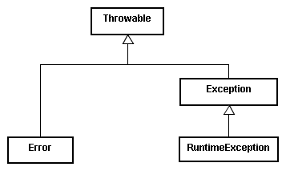

<!SLIDE section center>
# Tratamento de Exceções

<!SLIDE>
# Exemplo

Classe: Universidade

Método: void matricular (Aluno aluno, Curso curso)

Este método matricula um aluno em um Curso da Universidade.

Por exemplo, o aluno Paulo Rosa no Curso de BSI desta universidade.

<!SLIDE>
# Exemplo

Classe: Universidade

Método: void matricular (Aluno aluno, Curso curso)

Este método matricula um aluno em um Curso da Universidade.

Por exemplo, o aluno Paulo Rosa no Curso de BSI desta universidade.

.callout O que aconteceria se o aluno já estivesse matriculado no Curso?

.callout Como avisar quem chamou o método que a matricula não foi feita?

<!SLIDE>
# Abordagem Retorno Booleano

Uma abordagem seria _alterar a assinatura do método para retornar um
valor booleano_, sendo *true* quando a matrícula foi realizada com sucesso
e *false* em caso contrário.

Um trecho do tratamento do código poderia ficar da seguinte forma: 

    @@@ Java
    Faculdade faculdade = new Faculdade();
    if ( faculdade.matricular (aluno, curso) ) {
        System.out.println ("Matricula realizada com Sucesso!!!");
    } else {
        System.out.println ("Matricula não realizada!!!");
    }

<!SLIDE>
# Problema Abordagem Retorno Booleano

O problema desta abordagem é a possibilidade de apenas chamar o método sem realizar
o tratamento da condicional. 

    @@@ Java
    Faculdade faculdade = new Faculdade();
    faculdade.matricular (aluno, curso);
    System.out.println ("Matricula realizada com Sucesso!!!");

Neste caso, se não fosse possível realizar a matrícula, o resultado não seria identificado.

<!SLIDE>
# Questão Abordagem Retorno Booleano

Mesmo invocando o método da maneira correta, como indicaríamos o motivo pelo qual a matrícula não foi realizada?

<!SLIDE>
# Abordagem Retorno de Código

Uma outra abordagem seria retornar um código para indicar o resultado da operação matricular.

    @@@ Java
    Faculdade faculdade = new Faculdade();
    int codigo = faculdade.matricular(aluno, curso);
    if ( codigoErro == 0 ) {
      System.out.println ("Matricula realizada com Sucesso!!!");
    } else if ( codigoErro == -1 ) {
      System.out…(“Matricula não realizada”);
    }

<!SLIDE>
# Problema Abordagem Retorno de Código

O problema da abordagem baseada no tratamento do código é a necessidade
de conhecer todos os tipos possíveis de códigos retornados.

Além disso, uma quantidade grande de condicionais pode ser criado
no caso de haver uma quantidade grande de códigos de retorno.

Também fica complicado ter a cobertura de todos os códigos, ou seja,
no caso de surgir um código de retorno novo, como garantir que o tratamento
será realizado.

Outro pronto, também importante, é a má prática conhecida como *Magic Numbers*.
Magic Numbers, ou números mágicos, são são números que aparecem no código cuja 
semântica não é clara.

<!SLIDE>
# Remoção de Magic Numbers

<!SLIDE>
# Abordagem Tratamento de Erros

Para resolver todos estes problemas de uma forma mais elegante, Java realiza estes tratamentos com exceções (ou exceptions).

Ou seja, uma forma de tratar casos onde acontece algo que fugiu do normal, que não estava previsto para acontecer.

<!SLIDE>
# Exceções

Uma exceção é um evento que ocorre durante a execução de um programa em que 
ocorre uma interrupção do fluxo normal das instruções de um programa.

Uma exceção (ou exception) é um sinal que indica que algum tipo de 
condição excepcional ocorreu durante a execução do programa.

<!SLIDE>
# Exceções

Assim, exceções estão associadas a condições de erro que não tinham como serem verificadas durante a compilação do programa.

<!SLIDE>
# Sintaxe

    @@@ Java
    try {
        // código com comandos que podem gerar uma exceção.
    } catch ( Exception e) {
        // código para o tratamento da exceção associada e.
    } catch ( ...Exception .) {
        // código para o tratamento da exceção.
    } finally {
        // bloco de código que sempre será executado.
    }

<!SLIDE>
# Atividades de Tratamento de Erros

As atividades relacionadas à manipulação de exceções são:

* _Geração_

Sinalização de que uma condição excepcional (por exemplo, um erro) ocorreu

* _Captura_

A manipulação (tratamento) da situação excepcional onde as ações necessárias para a recuperação da situação de erro são definidas.

<!SLIDE>
# Exception Handler

Para toda a exceção que pode ocorrer durante a execução de um código, um bloco de ações de tratamento deve ser especificados.

As ações de tratamento são conhecidas como Exception Handler.

<!SLIDE>
# checked exceptions

O compilador Java verifica e força que toda exceção não-trivial tenha um bloco de tratamento associado.

As exceções deste tipo são chamadas: 
“checked exceptions”

<!SLIDE>
# Exemplo

    @@@ Java
    try {
        new FileReader("/tmp/testing.txt");
    } catch (FileNotFoundException e) {
        e.printStackTrace();
    }

<!SLIDE>
# Hierarquia de Classes de Exceções

Em Java, as exceções são representadas em uma hierarquia de classes.

<!SLIDE>
# Tipos de Exceções

Para cada tipo de exceção existe uma interpretação especial feita pelo compilador que se reflete na forma como o programador tem que lidar com elas.  

<table>
  <tr><th> Exceção </th><th> Classe </th>/<tr>
  <tr><td> Erro </td><td> Error</td>/<tr>
  <tr><td> Falha </td><td> RuntimeException</td>/<tr>
  <tr><td> Exceção de Contingência </td><td> Exception </td>/<tr>
</table>

A hierarquia de exceções em Java não tem como objetivo criar implementações ligeiramente diferentes da mesma coisa 
e sim diferenciar categorias diferentes de exceções. 

<!SLIDE>
# Erros

São exceções em que a aplicação não tem como resolver o problema. São erros todas as classes que descendem diretamente de Error.

Neste tipo de exceção, é importante que os erros sejam reportados e que se saiba que aconteceram, 
mas o programa não tem o que fazer para resolver o problema que eles apontam. 

Erros indicam que alguma coisa está realmente muito errada no funcionamento do código ou no ambiente de execução. 

Exemplos de erros:

 * _OutOfMemoryError_: lançada quando o programa precisa de mais memória mas ela não está disponível
 
 * _StackOverflowError_: lançada quando a pilha estoura (exemplo, quando um método se chama a si mesmo sem nunca retornar)

<!SLIDE>
# Falhas

São exceções que a aplicação causa e _pode_ resolver, mas _não é obrigada_ a fazê-lo. 
Se a aplicação nunca apanhar este tipo de exceção, tudo bem, a JVM irá capturá-la, mas provavelmente a aplicação não mais funcionará corretamente. 

São falhas todas as classes que descendem diretamente de _RuntimeException_.

Exemplos de falhas:

* _IllegalArgumentException_: lançada quando se passa um parâmetro para um método e o método não o pode usar

* _NullPointerException_: lançada sempre que tentar invocar um método em uma variável de objeto não inicializada (null).

<!SLIDE>
# Exceções de Contingência

São aquelas que a aplicação pode causar ou não, mas que tem que tratar explicitamente. 

Exceções de Contingência são todas aquelas que descendem diretamente de _Exception_ exceto as que descendem de RuntimeException.

As exceções de contingência se chamam assim porque freqüentemente representam exceções para as quais o programa deve ter um plano de contingência. 

Devido ao nome sugestivo é comum confundir o conceito de exceção com a própria classe Exception. 

Exemplos de exceção de contigência:

* _FileNotFoundException_:  significa que o arquivo que estamos tentando ler, não existe. 
Isto é uma exceção no sentido que o programa espera que o arquivo exista, contudo, se ele não existir o 
programa deve ter um plano B.

<!SLIDE>
# Alguns Exemplos de Erros

* NullPointerException
* ArrayIndexOutOfBoundsException
* ArithmeticException

Estes são problemas que poderiam ser evitados pelo programador.

Por este motivo, Java criou as Exceções não checadas (ou unchecked), não é necessário colocar try / catch.

<!SLIDE>
# Exceções Checadas

No caso anterior, não foi necessário incluir o try / catch (compilou e rodou).

Quando temos exceções do tipo checked, quem chama o método ou o construtor que declara a exceção, é obrigado a tratá-la. 

<!SLIDE>
# Bloco Try / Catch

Há duas maneiras para fazer funcionar:

* tratar com try / cath

    @@@ Java
    try {
        new java.io.FileInputStream("arquivo.txt");
    } catch (java.io.FileNotFoundException e) {
        System.out.println("Nao foi possível abrir o arquivo para leitura");
  	}

* delegar para quem chamou, a exceção

    @@@ Java
    public static void metodo() throws java.io.FileNotFoundException {
    	new java.io.FileInputStream("arquivo.txt");
    }

<!SLIDE>
# Classes de Exceção Customizadas

* É possível criar as próprias classes de exceção.

* Para criar uma nova exceção deve-se estender a classe Exception ou uma de suas subclasses.

* Uma classe de exceção é uma classe normal e, portanto, pode ter métodos e atributos.

  
  

<!SLIDE>
# Exemplo Classe Customizada

    @@@ Java
    public class ArquivoMuitoGrandeException extends Exception {
	
    } 

<!SLIDE>
# Condição de Exceção

Para gerar uma condição de erro durante a execução de um método e lançar uma exceção, um objeto desta classe deve ser criado e utilizado  com o comando throw. 

<!SLIDE>
# Exemplo Condição de Exceção

Lançar a execção criada

    @@@ Java

<!SLIDE>
# Bloco Finaly

* O bloco finaly é opcional e quando presente é sempre executado.

* Em geral, é utilizado para a liberação de recursos independentemente se ocorreu uma exceção ou não.

<!SLIDE>
# Exemplo Bloco Finaly

    @@@ Java

<!SLIDE>
# Referências para Estudo

Exceções e controle de erros

https://www.caelum.com.br/apostila-java-orientacao-objetos/excecoes-e-controle-de-erros/

<!SLIDE>
# Vantagens

* Separação do código principal do programa do código de tratamento de erro.
* Progagação de erros
* Tratamento para diferentes tipos de exeções.

<!SLIDE>
# Hierarquia de Exceções em Java

<!SLIDE>
# Checked Exceptions

* Filhas da classe Exception
* Parte da assinatura do método
* Checagem em tempo de compilação
* É necessário que o método faça o tratamento da exceção (try - catch - finally)
* Ou  o método deve lançar a exceção (declaração de throws na assinatura do método)
* Exemplo: FileNotFoundException

<!SLIDE>
# Unchecked Exceptions

* Filhas da classe RuntimeException
* Não é necessário declarar na assinatura do método
* Não há checagem em tempo de compilação
* Normalmente indica um erro de programação
* Exemplo: NullPointerException

<!SLIDE>
# Error

* Filhas da classe Error
* Indica um erro relacionado com a JVM
* São externos à aplicação
* As aplicações, em geral, não têm como lidar com estas exceções.
* Exemplo: OutOfMemoryError

<!SLIDE>
# Quando lançar Exceções?

* Quando indicam uma quebra de contato
* Quando o método encontra um condição anormal que ele não pode manipular.
* Se o método não está habilitado para preencher seu contrato, lança uma exceção checed ou unchecked.

<!SLIDE>
# Quando lançar uma Exception ou um Error?

* Error: quando está relacionado com erros da JVM
* Exception: o resto das exceções

<!SLIDE>
# Quando lançar exceções checadas ou não-checadas?

* Quem chamou o método pode tratar a exceção?
* Se SIM: checked
* Se NÃO: unchecked

<!SLIDE>
# Quando capturar uma exceção?

* Quando você puder manipulá-la
* Quando você quiser lançar outro tipo de exceção.

<!SLIDE>
# Exceções Checadas
* Lance uma exceção checada quando o chamador pode recuperar o erro.

<!SLIDE>
# Exceções não-checadas
* Lance uma exceção não-checada (runtime) para erros de programação.
* Lance uma exceção não-checada (runtime) quando o chamador não pode recuperar o erro.

<!SLIDE>
# Captura das Exceções

* Não capture uma exceção se você não pode fazer alguma coisa com ela
* Lance o quanto antes e capture mais tarde.

    
    
    

<!SLIDE>
# Log de Exceções

* Log a exceção apenas uma única vez e no tempo mais tarde possível.
* Log todos os dados da exceção
* Assegure que os logs não causem NullPointerException

    
    
    

<!SLIDE>
# Encadeamento de Exceções

    @@@ Java
    try {
      // código que lança a exeção AnyException
    } catch ( AnyException e) {
      throw new AnotherException (e);
    }

~~~SECTION:notes~~~

Referências:
 * http://www.javabuilding.com/academy/java-language/excecoes-conceitos.html
 * https://pt.slideshare.net/elainececiliagatto/lpii-tratamento-de-erros
 * https://pt.slideshare.net/leofreitas/exceptions-em-java-uff
 * 
 
~~~ENDSECTION~~~

