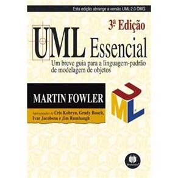

<!SLIDE section center>
# UML

<!SLIDE>
# Como comunicar uma solução?

Independente do tamanho do seu problema é importante que exista alguma
forma de comunicar sua solução sem a necessidade de construir o código.

Também é importante que, dado um software já construído, exista alguma
forma de representá-lo sem a necessidade de mostrar o código.

.callout A solução de um problema utilizando o _Paradigma Orientado a Objetos_
pode ser comunicado por meio de uma Linguagem de Modelagem.

<!SLIDE>
# Unified Modeling Language (UML)
## Linguagem de Modelagem Unificada

UML é uma Linguagem Padrão para:

* Visualização

* Especificação

* Construção

* Documentação

de Software Orientado a Objetos.

<!SLIDE>
# Visualização

* A existência de um modelo visual facilita a comunicação e faz com que os menbros de um grupo tenham a mesma ideia do sistema.

* Cada símbolo gráfico tem uma semântica bem definida.

<!SLIDE>
# Especificação

* É uma ferramenta poderosa para a especificação de diferentes aspectos arquiteturais e de uso de um sistema.

<!SLIDE>
# Construção

* Geração automática de código a partir do modelo visual.

* Geração do modelo visual a partir do código.

Ambientes de desenvolvimento permitem:

* movimentação em ambos os sentidos

* manutenção da consistência entre as visões

<!SLIDE>
# Documentação

Pode incluir artefatos como:

* Especificação de requisitos do sistema

* Especificações funcionais

* Planos de teste

* Materiais importantes para controlar, medir e refletir sobre um sistema durante o desenvolvimento e a implantação

<!SLIDE>
# Descrição da Arquitetura

UML oferece uma forma padrão para desenhar a Arquitetura de um Sistema.

* Processos de Negócio

* Funcionalidades do Sistema

* Classes

* Esquemas de Banco de Dados

* Componentes de Software

* ...

<!SLIDE>
# Por que Modelar?

* para comunicar a estrutura e o comportamento desejado de um sistema.

* para visualizar e controlar a arquitetura de um sistema.

* para melhorar o entendimento de um sistema expondo oportunidades para melhorias e reutilizações.

* para administrar riscos e trade-offs.

<!SLIDE>
# Diagramas da UML

Diagrama é uma representação gráfica de uma coleção de elementos de um modelo.

São desenhados para permitir a visualização de um sistema sob diferentes perspectivas.

Tipos de Diagramas

* Diagramas estruturais

* Diagramas Comportamentais

<!SLIDE>
# Diagramas Estruturais

Usados para visualizar, especificar, construir e documentar aspectos Estáticos de um sistema.

* Diagrama de Classes

* Diagrama de Objetos

* Diagrama de Pacotes

* Diagrama de Componentes

* Diagrama de Implantação

<!SLIDE>
# Diagrama de Classes

* Oferece uma visão estática da estrutura do sistema.

* Exibe classes e relacionamentos entre elas.

<!SLIDE>
# Para que serve o Diagrama de Classes?

Descreve os tipos de objetos no sistema e os vários tipos de relacionamentos estáticos que podem existir entre eles.

<!SLIDE>
# Diagramas Comportamentais

Usados para visualizar, especificar, construir e documentar aspectos Dinâmicos de um sistema:

* Diagrama de Casos de Uso

* Diagrama de Sequência

* Diagrama de Colaboração

* Diagrama de Estados

* Diagrama de Atividades

<!SLIDE>
# Diagrama de Casos de Uso

* Um caso de uso é uma interação típica entre um usuário e um sistema.

* Um caso de uso captura alguma função visível ao usuário.

* Especificam e documentam o comportamento do sistema.

* Importantes para as organizações e para a modelagem de comportamentos do sistema.

* Não descreve a organização interna do software.

<!SLIDE>
# Ferramentas CASE

**C**omputer-**A**ided **S**oftware **E**ngineering
Ferramentas computacionais que ajudam nas atividades de engenharia de software.

Exemplos de Ferramentas

* Ferramentas Livres

 * astah community (http://astah.net/editions/community)

 * argoUML (http://argouml.tigris.org/)

* Ferramentas Pagas

 * Visual Paradigm (http://www.visual-paradigm.com/)

 * Enterprise Architect (http://www.sparxsystems.com/products/ea/)

<!SLIDE>
# Relacionamento entre Classes no Diagrama

Descreve os tipos de objetos no sistema e os vários tipos de relacionamentos estáticos que podem existir entre eles.

Tipos de relacionamento:

* Subtipos (Herança)

* Delegações (Associações)

<!SLIDE>
# Classes no Diagrama

Diagramas de classes mostram (comunicam):

* atributos e métodos de uma classe 

* restrições à maneira com que os objetos são conectados

<!SLIDE>
#  Notação UML para Classes

<!SLIDE>
#  Exemplo Diagrama de Classes

<!SLIDE>
# Bibliografia
## UML Essencial: Um breve guia para a linguagem Padrão

**Editora**: Bookman Companhia

**Autor**: Martin Fowler

http://martinfowler.com/books/uml.html

