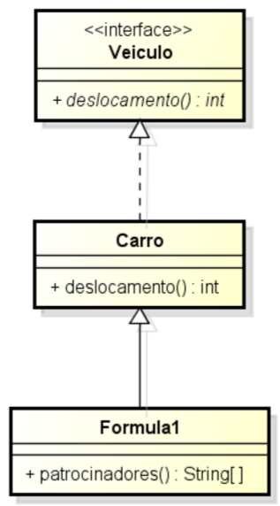

<!SLIDE section center>
# Vinculação Dinâmica

<!SLIDE>
# Hierarquias de Classes

A criação de hierarquias de classes permite que se trate objetos de classes especializadas como se fossem classes mais gerais.

<!SLIDE>
# Exemplo
## Hierarquia de Veículos

<!SLIDE>
# Código em Java

    @@@Java
    Carro [ ] carros = new Carro [2];
    carros [0] = new Carro ();
    carros [1] = new Formula1();
    for (Carro c : carros) {
	    System.out.println ( c.deslocamento() );
    }
    
    
<!SLIDE>
# Vinculação Dinâmica

    @@@Java
    Carro [ ] carros = new Carro [2];
    carros [0] = new Carro ();
    carros [1] = new Formula1();
    for (Carro c : carros) {
	    System.out.println ( c.deslocamento() );
    }

Quando um método é chamado, não importa o tipo declarado da variável, a máquina virtual invoca o método com base no tipo real do objeto.

<!SLIDE>
# Typecast ou Coerção

Se o método String [ ] getPatrocinadores() for adicionado à classe Formula1, então para chamar este método a partir de uma variável do tipo Carro, é necessário informar ao compilador que a variável refere-se a um Formula1.

    @@@Java
    Carro [ ] carros = …;
    String [ ] p = carros[0].getPatrocinadores();

.callout.error Erro de Compilação.

<!SLIDE>
# Typecast ou Coerção

Se o método String [ ] getPatrocinadores() for adicionado à classe Formula1, nentão para chamar este método a partir de uma variável do tipo Carro, é necessário informar ao compilador que a variável refere-se a um Formula1.

    @@@Java
    Carro [ ] carros = …;
    String [ ] p = ( (Formula1) carros[0] ).getPatrocinadores();

.callout.success Compilador Aceita.

<!SLIDE>
# Checagem de Tipos

Para se certificar que um objeto é de um dado tipo, pode-se verificar em tempo de execução o real tipo de um objeto. Há duas maneiras para isto:

    @@@Java
    if ( carros[0].getClass() == Formula1.class )‏  { 
        Formula1 f = (Formula1)carros[0]; 
    } 

    if ( carros[0] instanceof Formula1 )‏ { 
        Formula1 f = (Formula1) carros[0]; 
    } 

